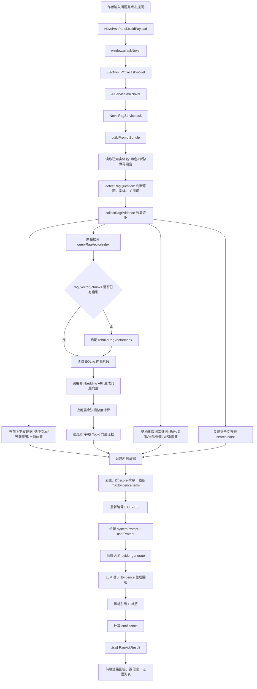
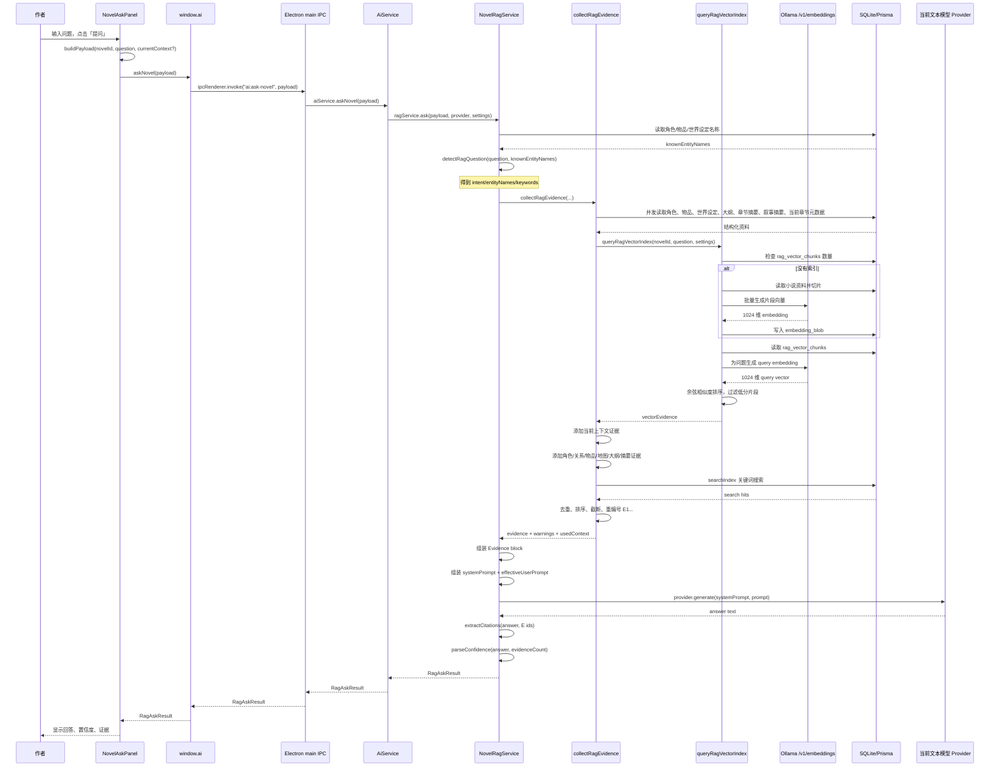

# RAG 提问流程图

本文档描述当前实现中，作者在「小说问答」里点击「提问」后，系统如何得到答案。

相关入口：

- 前端面板：`apps/desktop/src/components/AIWorkbench/NovelAskPanel.tsx`
- IPC：`apps/desktop/electron/preload.ts`、`apps/desktop/electron/main.ts`
- AI 服务：`apps/desktop/electron/ai/AiService.ts`
- RAG 编排：`apps/desktop/electron/ai/rag/NovelRagService.ts`
- 证据收集：`apps/desktop/electron/ai/rag/evidence.ts`
- 向量检索：`apps/desktop/electron/ai/rag/vectorIndex.ts`
- Embedding API：`apps/desktop/electron/ai/rag/embeddingClient.ts`

## 总览流程图

## 序列图

## 当前实现的关键规则

1. 「预览提示词」和「提问」都会执行证据检索与提示词组装；区别是预览不会调用最终文本模型。
2. 向量索引表是 `rag_vector_chunks`。你当前重建成功后，片段向量以 1024 维 Float32 BLOB 存储。
3. 一次提问时，如果索引表里已有当前小说的片段，就直接读取并计算相似度；如果没有片段，会自动触发一次索引构建。
4. 当前没有使用 `sqlite-vec`。检索方式是从 SQLite 读出片段向量后，在应用层做余弦相似度计算。
5. 最终证据不是只有向量检索结果，还会混合角色卡、关系、物品、地图标记、大纲情节点、章节摘要、叙事摘要、关键词搜索结果和当前章节上下文。
6. 证据会先去重，再按分数排序，最后重新编号为 `[E1]`、`[E2]`。
7. “高置信度”当前主要由回答内容和证据数量推断：如果回答没有表示资料不足，且证据数量达到阈值，就可能显示高置信度。

## 当前提问示例的路径

问题：`顾野现在是什么状态？`

大致会被识别为：

- `intent`: `character_state`
- `entityNames`: 如果角色库存在「顾野」，会命中「顾野」
- `keywords`: 可能包含「顾野」等有效词

证据收集时会优先提高这些资料的分数：

- 顾野的角色卡
- 顾野相关关系
- 顾野持有或相关物品
- 顾野地图位置
- 向量检索命中的章节正文/摘要/情节点片段
- 关键词搜索命中的章节片段

然后 LLM 只拿最终 Evidence block 作答，并被 systemPrompt 要求引用 `[E1]` 这类证据标签。
