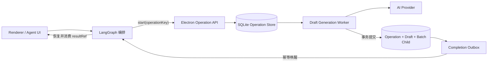
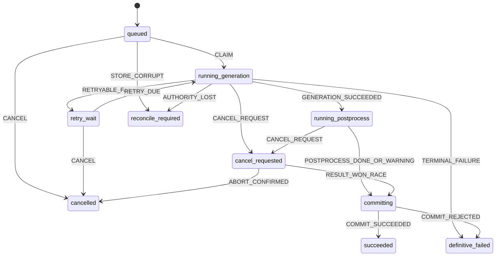

# Agent 持久化异步草稿 Operation 需求与技术方案

状态：完成 v1.5（Phase 0–5 已落地；当前版本为唯一切换基线，不支持旧 Runtime 回退）<br>
日期：2026-07-29<br>
适用范围：LangGraph、Python Agent Runtime、Electron Automation、AiService、DraftSession、Agent Renderer、章节单章生成与多章节批次生成。

## 1. 背景

当前 `chapter.generate_draft` 是同步副作用工具：Python Runtime 发起一次 Automation 请求，Electron 在同一请求生命周期内完成模型生成、章节状态抽取和 DraftSession 创建，再把最终结果返回给 Python。

2026-07-28 的实际故障暴露了该链路的结构性问题：

- `chapter.generate_draft` 的 Electron Automation 外层时限为 360 秒。
- `AiService.continueWriting` 未向 Provider 传递草稿专用时限。
- HTTP Provider 使用约 60 秒的默认总时限，并在达到时限后中止仍在流式生成的 Responses 请求。
- Python 已经把副作用调用记为 `in_flight`，但无法判断请求是在生成前失败、Provider 已生成但响应丢失，还是草稿已经创建但结果回执丢失。
- Runtime 因此把调用统一升级为 `SIDE_EFFECT_UNKNOWN`，禁止自动重放，并要求用户人工核对草稿中心。

当前的 fail-closed 行为避免了盲目重发造成重复草稿，但不能满足长篇生成、进程重启、断线恢复和批次任务的产品需求。

本需求将草稿生成从“长时间同步副作用调用”改造成“可持久化、可查询、可恢复的异步业务 Operation”。

## 2. 已确认决策

1. 单章和多章节草稿生成启用持久化异步 Operation；不再依赖一个持续数分钟的 Python 到 Electron HTTP 请求承载任务生命周期。
2. LangGraph 继续作为上层业务编排和 checkpoint 框架，不替换 LangGraph。
3. Electron Main 是草稿 Operation 的执行边界和权威状态所有者，负责 AI 设置、Provider 调用、取消、重试、草稿创建和恢复。
4. 草稿 Operation、DraftSession、DraftBatch 和 DraftBatchChild 最终进入同一个 SQLite 业务库，使草稿提交和 Operation 成功可以在同一事务中完成。
5. 首期不引入 Temporal、BullMQ、Inngest 等新的工作流或队列系统。
6. 首期不引入 XState。Electron 使用显式 TypeScript 状态转换器、SQLite 事务、唯一约束和乐观锁实现 Operation 状态机。
7. 当状态机出现明显的嵌套状态、并行区域或模型化测试需求时，才评估引入 XState v5；即使引入，SQLite 仍是权威状态源。
8. 新流程不以 `runId` 作为幂等操作身份。Run、HTTP request 和 Provider attempt 必须使用不同标识。
9. 新流程中的连接断开或返回超时不会立即变成 `SIDE_EFFECT_UNKNOWN`，而是按 `operationId` 或 `operationKey` 查询权威状态。
10. 架构切换时允许一次性删除升级前的历史 Agent 会话、Run、草稿会话、草稿批次、调用账本和 Graph checkpoint，不开发 JSON 导入器或 legacy reconciliation reader；小说、卷、正式章节及其他创作数据不得删除。
11. `SIDE_EFFECT_UNKNOWN` 只保留为权威 Operation 数据库不可用或损坏时的最后保护状态，不再是普通 Provider 失败的默认分类。

### 2.1 2026-07-29 实施快照

已完成：

- 草稿总时限、首包时限、流式 idle 时限拆分，并传播取消信号。
- SQLite `DraftGenerationOperation / Attempt / Outbox`、显式 TypeScript 状态转换器、CAS、lease、heartbeat、自动 attempt 重试和启动恢复。
- `chapter.draft.start / get_status / cancel / retry` 协议。
- Python 使用不含 `runId` 的稳定 `operationKey`，start 回执丢失时安全重试，之后只查询权威 Operation；成功后按 `draftSessionId` 读取结果。
- Python Run 保存 Operation 投影；非终态会进入持久化的 `waiting_operation` interrupt。两次兜底查询之间只保留定时器，不占用 LangGraph 节点或长生命周期轮询 task；Runtime 重启后重新挂接原 Operation，不创建第二个业务任务。
- Completion outbox 已接入 Electron → Python 投递，失败持久化退避重试；通知只负责唤醒，Python 始终重新查询 Electron/SQLite 权威状态。
- `DraftSession / DraftBatch / DraftBatchChild` 分表写入主 SQLite；`DraftSessionStore` 强制要求数据库，不再包含 `draft-sessions.json`、`DraftWorkspaceState` 或无数据库写入路径。
- 模型正文与后处理结果先写入 Operation 的 `generatedPayloadJson` 作为可恢复 payload；随后在一个 SQLite 事务内完成 DraftSession 插入、DraftBatch/DraftBatchChild 更新、revision/sourceOperationId 校验、Operation `COMMIT_SUCCEEDED` CAS 和 completion outbox 插入。任一步失败都会整体回滚，不再存在结果实体与 Operation 终态之间的物理两段提交窗口。
- Electron 重启遇到 `running_postprocess / committing` 时直接使用已持久化的 prepared payload 完成提交，不重新调用模型；旧 generation revision 的迟到 payload 会被 revision fence 拒绝并收敛为明确失败。
- 一次性切换清理 Agent 会话、Run、附件、修订任务、草稿工作区、Operation 与 Python checkpoint，并写版本 marker；Novel、Volume、Chapter 和正式正文不在删除清单内。
- Renderer 活动流展示受理、生成、等待重试、整理、保存和完成阶段。
- 系统级测试已覆盖并发 start、提交边界崩溃回滚、重复/乱序 completion、prepared payload 重启恢复、旧 revision 迟到和 outbox 唯一发布。

切换结论：

- 2026-07-29 明确决定无需外部灰度，当前版本直接作为唯一切换基线；旧 Runtime 与旧同步传输协议不再属于兼容范围。
- Phase 5 已执行：Electron 不再暴露同步 `chapter.generate_draft`，Python 对该语义工具无条件路由到 durable start/status/wait，MCP Bridge 只暴露 `chapter.draft.*` 传输接口。
- JSON fallback 已删除；测试统一使用临时 SQLite。SQLite 权威路径不存在 JSON writer 回退。

## 3. 目标

- `chapter.draft.start` 在短时间内返回持久化的 `operationId`，模型生成在后台继续。
- Renderer、Python Runtime 或 Electron Renderer 窗口关闭后，已经受理的生成任务仍可继续。
- Electron Main 和 Python Runtime 重启后，可以恢复或重新确认 Operation，而不是盲目重发。
- 相同业务请求可以安全重复提交，并返回同一个 Operation。
- 一个批次子章节的同一 generation revision 最多产生一个有效 DraftSession。
- Operation 成功与 DraftSession/BatchChild 关联在同一个 SQLite 事务中提交。
- LangGraph 可以在不占用长 HTTP 请求的情况下暂停并等待 Operation。
- 用户看到稳定的“排队、生成、整理、保存、完成、失败、取消”状态，而不是原始内部错误码。
- 自动重试、用户重试、取消和迟到响应拥有明确且可测试的竞争规则。
- 完整保留诊断、Provider attempt、耗时、Token 和恢复记录。

## 4. 非目标

- 不保证不同 Provider 对同一个幂等键提供 exactly-once 计费语义。
- 不保证 Provider 未提供 job/response 查询能力时可以恢复已经中断的远端计算过程。
- 不让 Agent 自动把草稿写回正式章节；DraftSession 审核和正文写回边界保持不变。
- 不在首期并行生成存在前后文依赖的多章节草稿。
- 不为了本需求引入 Redis、外部队列服务或新的常驻服务。
- 不把全部 Agent 工具都改成异步；只改造超过普通请求生命周期或需要后台恢复的能力。
- 不使用内存状态机、SSE 连接或 XState snapshot 代替 SQLite 业务事务。

## 5. 语义定义

### 5.1 期望交付语义

本系统采用：

- 命令投递：at-least-once。
- Operation 创建：按稳定幂等键 effectively-once。
- 本地草稿提交：通过事务和唯一约束 at-most-once。
- 用户可见结果：effectively-once。
- Provider 计算和计费：best-effort 去重，取决于 Provider 能力。

不得在产品或代码注释中笼统宣称跨 Provider 的绝对 exactly-once。

### 5.2 标识职责

| 标识 | 生命周期 | 用途 |
| --- | --- | --- |
| `operationId` | 一个持久化业务操作 | 状态查询、恢复、取消、结果引用 |
| `operationKey` | 一个业务意图与 generation revision | 幂等创建和去重 |
| `runId` | 一次 Agent 编排 Run | 会话归属与审计，不参与业务去重 |
| `requestId` | 一次 HTTP/Automation 传输 | 取消、日志和传输诊断 |
| `attemptId` | 一次 Provider 请求 | 重试、Token、模型、成本和错误审计 |

### 5.3 Operation Key

建议使用 canonical JSON 后计算：

```text
SHA256(
  operationType +
  novelId +
  draftBatchIdOrStandaloneScope +
  childIndexOrStandaloneTarget +
  generationRevision +
  canonicalInputHash
)
```

规则：

- 相同 `operationKey` 且相同 `paramsHash` 返回已有 Operation。
- 相同 `operationKey` 但不同 `paramsHash` 返回 `IDEMPOTENCY_CONFLICT`。
- `runId`、`requestId`、当前时间和随机数不得进入 `operationKey`。
- 独立单章草稿必须有稳定的 `generationRevision` 或等价业务 revision，不能每次重试都生成新身份。

## 6. 总体架构



职责边界：

- Renderer：发起、展示、取消、重新连接；不判断副作用是否发生。
- Python Runtime/LangGraph：业务计划、审批、章节顺序、等待和消费结果；不拥有草稿数据。
- Electron Operation API：幂等受理、状态查询、取消和重试命令。
- Electron Worker：Provider 调用、attempt 重试、后处理、心跳、lease 和事务提交。
- SQLite：Operation、attempt、草稿和批次状态的权威来源。
- Completion Outbox：保证 Operation 完成后即使 Python 暂时不可用，也能在之后重新通知。

## 7. 工具与接口契约

### 7.1 启动 Operation

新工具：

```text
chapter.draft.start
```

请求：

```ts
type StartChapterDraftOperationRequest = {
  operationKey: string;
  novelId: string;
  volumeId?: string;
  chapterId: string;
  draftBatchId?: string;
  childIndex?: number;
  generationRevision: number;
  sourceSnapshot: {
    chapterId: string;
    version: number;
    contentHash: string;
  };
  payload: ChapterDraftPayload;
  operationDeadlineAt: string;
  owner: {
    conversationId: string;
    runId: string;
    stepId: string;
  };
};
```

响应：

```ts
type StartChapterDraftOperationResponse = {
  operationId: string;
  operationKey: string;
  status: DraftOperationStatus;
  phase: DraftOperationPhase;
  acceptedAt: string;
  version: number;
  pollAfterMs: number;
  existing: boolean;
};
```

接口要求：

- 在完成参数校验和 Operation 持久化后尽快返回，不等待模型生成。
- 同一个 `operationKey` 的并发调用只能创建一条记录。
- 已成功的 Operation 直接返回 `succeeded` 和既有结果引用。
- 已失败的 Operation 不因重复 `start` 自动创建新 attempt；重试必须使用显式 retry 命令。

### 7.2 查询状态

```text
chapter.draft.get_status
```

```ts
type DraftOperationStatusResponse = {
  operationId: string;
  operationKey: string;
  status: DraftOperationStatus;
  phase: DraftOperationPhase;
  version: number;
  attempt: number;
  progress?: number;
  heartbeatAt?: string;
  retryAt?: string;
  result?: {
    draftSessionId: string;
    draftBatchId?: string;
    childIndex?: number;
    generationRevision: number;
  };
  warnings: string[];
  error?: DraftOperationFailure;
  updatedAt: string;
};
```

该接口只读、幂等，可以使用有界网络重试。

### 7.3 取消

```text
chapter.draft.cancel
```

请求必须携带 `operationId` 和 `expectedVersion`。取消是请求，不是立即成功的承诺：

- `queued/retry_wait` 可以确定性进入 `cancelled`。
- `running_generation/running_postprocess` 先进入 `cancel_requested` 并触发 AbortController。
- `committing` 不接受破坏事务的强制取消；提交成功可以赢得竞争。
- 终态重复取消返回当前终态，不报内部错误。

### 7.4 显式重试

```text
chapter.draft.retry
```

只允许：

- 当前状态为 `definitive_failed`。
- `error.retryEligible=true`。
- 没有更新 generation revision 的替代 Operation。
- 总 attempt、deadline 和成本预算未耗尽。

重试保留同一个 `operationId/operationKey`，创建新的 `attemptId`。如果用户改变生成要求或源章节版本，则创建新的 generation revision 和新的 Operation。

### 7.5 旧接口兼容

旧 `chapter.generate_draft` 在代码过渡期保留为兼容适配器：

1. 生成稳定 `operationKey`。
2. 调用 `chapter.draft.start`。
3. 使用 status 查询等待结果。
4. 返回原有结果结构。

新 LangGraph 的计划层可以继续使用语义工具名 `chapter.generate_draft`，但 Runtime 必须在传输前将其路由到 durable start/status/wait 流程，不得把它作为同步 Automation 请求发送。兼容接口不得成为新的持久化状态所有者。

## 8. Operation 状态机

### 8.1 状态

```ts
type DraftOperationStatus =
  | 'queued'
  | 'running_generation'
  | 'retry_wait'
  | 'running_postprocess'
  | 'committing'
  | 'cancel_requested'
  | 'succeeded'
  | 'definitive_failed'
  | 'cancelled'
  | 'reconcile_required';
```

`phase` 是面向进度展示和兼容演进的粗粒度阶段，不承担转换合法性判断：

```ts
type DraftOperationPhase =
  | 'accepted'
  | 'generating'
  | 'postprocessing'
  | 'committing'
  | 'terminal';
```

转换合法性只以持久化的 `status + version` 为准。

终态为：

- `succeeded`
- `definitive_failed`
- `cancelled`
- `reconcile_required`

`reconcile_required` 不是普通失败重试状态，只用于新架构权威记录缺失或损坏。升级前旧调用在一次性清理中删除，不进入新状态机。

### 8.2 状态图



### 8.3 转换实现

首期实现纯 TypeScript 转换器：

```ts
transitionDraftOperation(current, event, context): TransitionResult
```

转换器必须：

- 穷举状态与事件。
- 不直接访问网络、文件或数据库。
- 返回目标状态、字段 patch 和应创建的 command/outbox event。
- 对非法转换返回结构化 `INVALID_OPERATION_TRANSITION`。
- 使用单元测试覆盖完整转换矩阵。

数据库写入必须使用事务和 compare-and-swap：

```sql
UPDATE DraftGenerationOperation
SET status = ?, version = version + 1, updatedAt = ?
WHERE operationId = ?
  AND status = ?
  AND version = ?;
```

更新行数为 0 时重新读取权威状态；不得用内存中的旧状态覆盖数据库。

### 8.4 引入 XState 的门槛

满足以下任意两项后，可以提交独立 ADR 评估 XState v5：

- 出现两个以上需要协调的并行状态区域。
- 状态或事件数量增长到手写转换矩阵难以审查。
- 需要复用层级状态、history state 或 actor supervision。
- 需要基于状态图自动生成路径测试或供产品协同可视化。
- 多种异步 Operation 需要共享可组合状态机定义。

即使引入 XState：

- 只在 Electron Main 运行，不在 Renderer 维护第二个权威 actor。
- XState snapshot 不是数据库事务的替代品。
- 外部 Provider 调用仍必须幂等。
- 状态恢复后不得因 invoked actor 自动重启而重复生成。

## 9. SQLite 数据模型

### 9.1 DraftGenerationOperation

至少包含：

```text
operationId                 PK
operationKey                UNIQUE
operationType
paramsHash
novelId
volumeId                    nullable
chapterId
draftBatchId                nullable
childIndex                  nullable
generationRevision
sourceChapterVersion
sourceContentHash
status
phase
version
attemptCount
maxAttempts
operationDeadlineAt
progress                    nullable
heartbeatAt                 nullable
leaseOwner                  nullable
leaseExpiresAt              nullable
cancelRequestedAt           nullable
resultDraftSessionId        nullable
resultJson                  nullable
warningJson
errorCode                   nullable
errorJson                   nullable
sourceConversationId
sourceRunId
sourceStepId
createdAt
startedAt                   nullable
completedAt                 nullable
updatedAt
```

约束：

```text
UNIQUE(operationKey)
UNIQUE(draftBatchId, childIndex, generationRevision) where draftBatchId is not null
```

独立单章生成需要等价的唯一业务约束，避免同一目标 revision 产生两份有效草稿。

### 9.2 DraftGenerationAttempt

每次 Provider 派发建立一条 attempt：

```text
attemptId                   PK
operationId                 FK
attemptNumber
requestId
providerType
providerProfileId
model
providerRequestId           nullable
providerResponseId          nullable
status
startedAt
firstTokenAt                nullable
lastChunkAt                 nullable
completedAt                 nullable
inputTokens                 nullable
outputTokens                nullable
estimatedCost               nullable
errorCode                   nullable
errorJson                   nullable
```

约束：

```text
UNIQUE(operationId, attemptNumber)
```

### 9.3 DraftSession 与批次

`DraftSession`、`DraftBatch`、`DraftBatchChild` 和 narrative state ledger 在 Prisma/SQLite 中重新建模。升级前 JSON 历史不导入；切换完成后的新草稿只写 SQLite。

`DraftSession` 增加：

```text
sourceOperationId
generationRevision
sourceChapterVersion
sourceContentHash
```

Operation 成功提交必须在同一个事务中：

```text
BEGIN
  INSERT DraftSession
  UPDATE DraftBatchChild SET draftSessionId/status
  UPDATE DraftBatch SET status/stateLedger/version
  UPDATE DraftGenerationOperation SET status=succeeded/resultDraftSessionId
  INSERT DraftOperationOutbox(completed event)
COMMIT
```

### 9.4 Completion Outbox

至少包含：

```text
outboxId
operationId
eventType
payloadJson
deliveryStatus
attemptCount
nextAttemptAt
createdAt
deliveredAt
```

Outbox 负责把完成事件最终送达 Python Runtime。通知只是加速恢复，Operation 数据库仍是权威来源；Python 也必须支持主动查询。

## 10. Worker、Lease 与恢复

### 10.1 Worker 领取

- Electron Main 启动后扫描 `queued`、到期的 `retry_wait` 和 lease 已过期的运行记录。
- 通过单条条件更新领取 Operation，写入 `leaseOwner/leaseExpiresAt`。
- Worker 运行期间周期更新 heartbeat 和 lease。
- 只有持有有效 lease 的 Worker 可以推进非终态。
- 每次数据库写入同时验证 `version` 和 lease owner。

### 10.2 Electron 重启

重启恢复规则：

- `queued`：重新领取。
- `retry_wait`：到期后重新领取。
- `running_generation` 且有可查询的 Provider response/job ID：查询远端状态。
- `running_generation` 且没有 Provider 查询能力：结束旧 attempt，并根据预算进入 `retry_wait` 或 `definitive_failed`。
- `running_postprocess`：从已经持久化的生成结果继续后处理；生成正文不得只留在内存中。
- `committing`：查询 DraftSession 与唯一业务键。草稿存在则补全 succeeded；不存在则重新执行事务提交。
- `cancel_requested`：继续取消或按实际提交结果完成竞争裁决。

如果 Provider 不支持异步结果查询，系统只能保证不重复提交本地草稿，不能保证远端计算或计费没有重复。

### 10.3 生成结果暂存

模型生成成功后、进入后处理前，正文或加密后的结果引用必须持久化，不能只保存在 Worker 内存中。敏感日志不得记录完整正文。

可以使用：

- Operation 受控结果字段；或
- 独立临时 payload 表/文件，并由数据库保存校验哈希和引用。

最终 DraftSession 提交完成后清理不再需要的临时结果。

## 11. LangGraph 改造

### 11.1 节点拆分

当前大 `advance` 节点中的草稿生成拆分为：

```text
prepare_draft_operation
  -> start_draft_operation
  -> wait_draft_operation
  -> consume_draft_result
  -> advance_batch_child
```

要求：

- `prepare_draft_operation` 计算确定性的参数快照和 `operationKey`。
- `start_draft_operation` 只调用幂等 start。
- `wait_draft_operation` 只查询状态和执行 `interrupt()`，不创建副作用。
- `consume_draft_result` 通过 result reference 读取既有 DraftSession，不重新生成。
- 多章节批次首期继续顺序执行，一个 child 完成后才启动下一个 child。

### 11.2 ExecutionState

增加：

```text
pendingOperationId
pendingOperationKey
pendingOperationVersion
pendingOperationStatus
operationResultRef
operationWakeupReason
```

Run 增加产品状态：

```text
waiting_operation
```

它不是 `waiting_approval`，不要求用户输入。

### 11.3 暂停和唤醒

- `wait_draft_operation` 保存待等待的 Operation 后调用 LangGraph `interrupt()`。
- Electron Outbox 通过幂等 Runtime 接口投递 Operation 状态变更。
- Python 使用 `Command(resume=...)` 恢复 Graph。
- 同一个 completion event 重复投递不得重复消费结果。
- 如果通知丢失，Runtime 启动恢复器和有界 fallback polling 必须能够发现终态。
- 不允许 LangGraph 节点持有数分钟的 Automation HTTP 请求或无限 polling 循环。

### 11.4 Python 重启

- `waiting_operation` Run 保持可恢复状态，不转成失败。
- Runtime 从 checkpoint 读取 `pendingOperationId` 并查询 Electron。
- Operation 成功则恢复 Graph；仍运行则继续等待；明确失败则按错误策略终止或等待用户重试。
- 新架构不应产生没有 operation reference 的异步草稿调用；如果发生，进入 `reconcile_required` 并记录数据完整性告警。

### 11.5 Python 调用账本

Python `tool_invocations` 不再是异步草稿 Operation 的权威状态，只保留编排投影和审计：

```text
prepared
accepted
running
succeeded
definitive_failed
cancelled
reconcile_required
```

增加 `operationId/operationKey/lastObservedVersion/resultRef`。传输失败后优先按 operation key 查询，不直接写 `unknown`。

## 12. 重试责任

### 12.1 唯一责任人

新异步草稿流程中：

- Electron Operation Worker 是实际模型生成 attempt 的唯一重试责任人。
- LangGraph 只重试幂等的 `start/get_status` 传输。
- Automation Server 不叠加生成重试。
- Renderer 不因连接断开重新 start。
- 用户点击重试调用显式 `chapter.draft.retry`，不创建隐式重复调用。

该规则是现有“每一层只有一个重试责任人”原则在异步草稿 Operation 上的专门化。

### 12.2 自动重试

只有以下错误可以进入 `retry_wait`：

- 明确发生在草稿提交前的临时网络错误。
- Provider `408/425/429/500/502/503/504`。
- 尚未发布可用结果的流式连接中断。
- Provider 明确标记的临时不可用。

以下错误进入 `definitive_failed`，不自动重试：

- 参数、权限、认证、能力不支持。
- 内容安全或供应商策略拒绝。
- 源章节版本冲突。
- operation deadline 或成本预算耗尽。
- 相同 operation key 参数冲突。
- 已经获得完整正文但事务提交发生不可恢复业务冲突。

默认 attempt 上限继续遵守全局韧性需求中的“首次请求 + 最多 3 次重试”，但整个 Operation 共用同一个 deadline 和成本预算。

## 13. 超时与 Deadline

### 13.1 分类

禁止继续使用一个从请求开始计算、达到 60 秒后无条件 Abort 的总计时器。

建议默认值：

| 时限 | 建议 | 行为 |
| --- | --- | --- |
| Connect timeout | 10–30 秒 | 无法连接时结束本 attempt |
| First-token timeout | 60–120 秒 | 首 token 未到达时结束本 attempt |
| Streaming idle timeout | 30–60 秒 | 每个有效 chunk 到达后重置 |
| Postprocess timeout | 独立配置 | 失败时允许保留正文并附 warning |
| Operation deadline | 5–10 分钟 | 所有 attempt、退避和后处理共享 |

### 13.2 统一 Deadline

创建 Operation 时写入不可延长的 `operationDeadlineAt`。Python、Electron、AiService 和 Provider 都从它计算剩余预算，不再各自创造相互矛盾的 deadline。

显式用户重试如果需要新预算，必须通过产品策略创建新的 generation revision 或经审计延长，不得静默重置旧 deadline。

## 14. 错误模型

```ts
type DraftOperationFailure = {
  code:
    | 'INVALID_INPUT'
    | 'IDEMPOTENCY_CONFLICT'
    | 'SOURCE_VERSION_CONFLICT'
    | 'PROVIDER_AUTH'
    | 'PROVIDER_POLICY_REJECTED'
    | 'PROVIDER_TIMEOUT'
    | 'PROVIDER_RATE_LIMITED'
    | 'PROVIDER_UNAVAILABLE'
    | 'RETRY_BUDGET_EXHAUSTED'
    | 'OPERATION_DEADLINE_EXCEEDED'
    | 'COST_BUDGET_EXCEEDED'
    | 'COMMIT_CONFLICT'
    | 'CANCELLED'
    | 'OPERATION_STORE_UNAVAILABLE'
    | 'RECONCILIATION_REQUIRED';
  retryEligible: boolean;
  userMessage: string;
  diagnosticRef: string;
  attempt?: number;
  providerRequestId?: string;
};
```

要求：

- 用户主界面只显示 `userMessage`。
- 完整 Provider body、API key、Authorization header 和完整正文不得进入 errorJson 或日志。
- `SIDE_EFFECT_UNKNOWN` 仅映射为 `RECONCILIATION_REQUIRED` 的异常展示，不再作为普通 Provider timeout 的用户文案。

## 15. 后处理与提交

- 章节状态抽取与正文生成是两个独立 phase。
- 正文生成成功后必须先持久化结果引用，再执行状态抽取。
- 状态抽取失败默认不丢弃正文，Operation 可以带 warning 进入 committing。
- DraftSession 创建前再次验证 source chapter version/contentHash 和 generation revision。
- 迟到的旧 revision 结果不得覆盖或附着到新 revision。
- 草稿提交事务成功后，即使 completion 响应或通知丢失，查询仍必须返回 succeeded。

## 16. Renderer 产品要求

用户状态统一为：

```text
排队中
正在生成
正在整理章节状态
正在保存草稿
将在稍后重试
正在取消
已完成
失败，可重试
需要人工处理
```

要求：

- 关闭 Inspector、切换会话或关闭 Renderer 不取消已受理任务。
- 连接断开显示“后台仍在继续，正在恢复状态”，不立即显示失败。
- 输入框右下角是唯一主任务控制：空闲时为“发送”，聊天生成或 Agent Run 活动时切换为 Codex 风格的圆形“停止任务”按钮；运行卡片不再重复展示通用停止按钮。
- `running / waiting_approval / waiting_user_input` 均可从统一入口停止；`cancelling` 显示“正在停止”并禁止重复点击。
- Operation 已进入 `committing` 时显示“正在保存”并禁用停止，提交事务完成后再展示最终竞争结果。
- 展示阶段和已用时间；精确百分比只有在来源可信时才显示。
- 明确失败且 `retryEligible=true` 才展示重试。
- `reconcile_required` 才展示人工核对入口。
- 原始 method、ledger status、requestId 和 diagnosticRef 收纳在可展开诊断区。
- Operation 完成后继续使用现有 DraftSession 审核，不自动写回章节正文。

## 17. 存量清理与破坏性切换

本次架构变更不保留升级前的 Agent 历史和草稿工作态，不开发 `draft-sessions.json` 到 SQLite 的数据导入器。这里的删除只针对 Agent/草稿工作数据，不得影响正式小说内容。这是一次性架构切换特例，不改变新版本对新会话、新 Run、新产物和新草稿的正常持久化规则。

### 17.1 允许清理的数据

- `draft-sessions.json` 中的 DraftSession、DraftBatch、DraftBatchChild 和 narrative state ledger。
- 历史 AgentConversation、AgentMessage、AgentRun、AgentRunEvent。
- 只由被删除会话或 Run 拥有、且尚未写入正式小说数据的 AgentArtifact、审批意见和临时附件引用。
- Python `agent_state.db` 中的 Run 状态、事件和 `tool_invocations`。
- LangGraph `agent_graph.db` 中的旧 Run checkpoint。
- 与上述记录对应的临时生成结果、诊断投影和未完成恢复标记。

如附件文件还被小说素材、正式章节或其他未删除对象引用，不得随会话清理。

### 17.2 必须保留的数据

- Novel、Volume、Chapter 及其正式正文、版本和删除标记。
- 人物、物品、世界设定、情节线、情节点、摘要、标签等小说项目数据。
- 已经写入正式章节或正式素材库的用户创作成果。
- AI Provider 设置、模型设置和不属于历史会话的应用配置。
- 不能证明只属于待删除 Agent 历史的数据。

清理历史 DraftSession 会使旧草稿审核、旧产物回看和依赖 DraftSession 的旧撤销入口失效；正式章节当前内容不受影响。

### 17.3 切换步骤

1. 进入维护状态，禁止创建新 Agent Run、DraftSession 和草稿 Operation。
2. 确认没有仍需保留的运行中任务；活动任务必须先取消并等到终态，不能边执行边清理。
3. 创建新的 Prisma/SQLite Operation、Attempt、Outbox、DraftSession 和 DraftBatch schema。
4. 使用明确表名和明确文件路径清理允许删除的数据；不得按目录递归删除数据库或用户数据目录。
5. 删除或清空旧 `draft-sessions.json`，不解析、不导入其中的历史记录。
6. 清理旧 Python invocation ledger 和 LangGraph checkpoint，使新版本不会尝试恢复旧 Run。
7. 写入 `draftOperationCutoverVersion` 标记和清理报告，记录删除数量、保留数量、执行版本和完成时间，但不保存已删除正文内容。
8. 启用 SQLite DraftSession writer 和异步 Operation；禁止重新启用旧 JSON writer。
9. 执行新建单章草稿、取消、重启恢复和批次第一章 smoke test 后退出维护状态。

切换脚本必须幂等：重复执行只能确认旧数据已经清理并补齐 schema/marker，不能删除切换后创建的新 Operation 或 DraftSession。

### 17.4 不再需要的兼容能力

- 不需要 JSON 导入器、双读、双写或数据 checksum 对账。
- 不需要为升级前 `unknown/in_flight` Invocation 保留人工认领流程。
- 不需要根据文本相似度查找旧候选草稿。
- 不需要 legacy DraftSession reader 或一至两个版本的历史兼容期。

`reconcile_required` 仍保留，用于切换完成后新 Operation 数据库出现不可用、损坏或违反不变量的极端情况。

## 18. 分阶段实施

### Phase 0：止血

- 为 `continueWriting` 传入草稿生成专用时限。
- 把 Provider 总超时拆分为 connect、first-token 和 idle timeout。
- 统一传播 deadline 和 AbortSignal。
- 明确发生在本地写入前的 Provider 错误不再伪装成“草稿可能已写入”。

退出条件：当前 60 秒稳定中止问题消失，现有行为测试通过。

### Phase 1：Operation Store 与协议

- 添加 Operation、Attempt、Outbox、DraftSession、DraftBatch 和 DraftBatchChild schema。
- 实现 TypeScript 状态转换器。
- 实现 start/status/cancel/retry。
- 实现 Worker、lease、heartbeat 和启动恢复。
- 实现 Operation、草稿、批次和 Outbox 的原子提交。
- 保持异步功能开关关闭；旧同步入口只用于切换前回归，不允许把新 Operation 写进 JSON。

退出条件：新库协议、状态机和事务测试通过；start 响应丢失后可以通过 operationKey 找回同一个任务；并发 start 只创建一条记录。

### Phase 2：存量清理与 SQLite 切换

- 进入维护状态并停止创建新 Agent/草稿工作数据。
- 清空升级前历史 Agent 会话、Run、DraftSession、Batch、Invocation 和 checkpoint。
- 写入切换 marker 和清理报告。
- 将 DraftSession/Batch 的唯一 writer 切换为 SQLite。
- 删除或永久禁用旧 JSON writer，不开发导入器和 fallback reader。

退出条件：清理脚本可重复执行；正式小说数据数量和正文 hash 保持不变；新 DraftSession 只进入 SQLite。

### Phase 3：LangGraph 异步等待

- 拆分草稿生成节点。
- 增加 `waiting_operation`、interrupt 和幂等 wakeup。
- 修改 Python invocation ledger 为 Operation 投影。
- Runtime 重启恢复等待中的 Run。
- 开启异步草稿功能开关。

退出条件：杀掉并重启 Python Runtime 后，原 Run 能消费原 Operation 结果，不产生第二份草稿；在提交事务各边界注入崩溃不破坏业务不变量。

### Phase 4：Renderer 与自动恢复

- 新增后台 Operation 状态投影。
- 实现断线恢复、阶段展示、取消和明确失败重试。
- 人工对账只服务于新 Operation 数据库损坏或不变量破坏，不展示旧历史入口。

退出条件：正常 Provider 超时、应用重连和 Python 重启不再向用户展示 `SIDE_EFFECT_UNKNOWN`。

### Phase 5：清理兼容层

- 已下线旧同步生成调用。
- 已删除旧 JSON store 和无数据库 fallback；候选草稿扫描与新架构仍需的 `reconcile_required` 诊断边界分离。
- 已删除旧同步能力探测和相关测试假设，草稿持久化测试统一使用临时 SQLite。
- 保留新架构 `reconcile_required` 的异常保护和诊断能力。

## 19. 功能开关与灰度

建议：

```text
draftAsyncOperations
graphOperationWait
draftSqliteStore
draftOperationAutoRecovery
```

灰度顺序：

1. 开发环境单章生成。
2. 单章生成小范围用户。
3. 多章节批次的第一个 child。
4. 顺序多章节批次。
5. 再生成、取消和 revision 冲突。
6. 全量 Agent 草稿任务。

基线决策：2026-07-29 确认无需外部灰度，以上场景由开发环境、自动化故障测试和当前版本验收覆盖；当前版本直接成为唯一切换基线。后续版本不得恢复旧同步入口或 JSON writer。

回滚规则：

- Phase 1 尚未执行清理时，可以关闭新代码并继续旧流程。
- Phase 2 清理完成后，历史 Agent/草稿工作数据不可恢复；切换前必须明确展示这一事实。
- SQLite 成为权威写入后，只能回滚功能开关，不能回滚到旧 JSON writer。
- 切换 marker 必须阻止不兼容旧版本重新写入 JSON 或误读已清理状态。
- Schema 变更使用向前兼容字段；不得通过删除新表回滚。
- 回滚不能重发状态未知的旧 Provider 请求。

## 20. 可观测性

所有日志、事件和诊断必须关联：

```text
operationId
operationKey hash prefix
runId
requestId
attemptId
draftBatchId/childIndex/generationRevision
provider/model
```

指标至少包括：

- 各状态停留时长。
- 排队时间、首 token 时间、流式 idle 时间、后处理和提交时间。
- 自动 attempt 次数和失败分类。
- lease 过期和恢复次数。
- Outbox 投递延迟和重试次数。
- `reconcile_required` 比例。
- 相同 operationKey 冲突数。
- 重复 DraftSession 唯一约束冲突数。
- succeeded Operation 缺少 DraftSession 的数量。
- 用户取消成功率和取消竞争结果。

以下不变量告警必须为最高优先级：

- `succeeded` Operation 没有有效 `resultDraftSessionId`。
- 同一 batch child revision 存在多个有效草稿。
- DraftSession 的 operation/revision 与 BatchChild 不一致。
- 终态 Operation 被回写为非终态。

## 21. 测试要求

### 21.1 状态机单元测试

- 覆盖每个合法转换。
- 覆盖每个非法转换。
- 覆盖取消与提交竞争。
- 覆盖 retry budget、deadline 和 stale revision guard。
- 覆盖 CAS 冲突后重读行为。

### 21.2 协议与数据库测试

- 相同 key/相同 hash 幂等返回。
- 相同 key/不同 hash 冲突。
- 并发 start 只创建一个 Operation。
- Operation、DraftSession、BatchChild、Outbox 原子提交。
- Outbox 重复投递和 Runtime wakeup 幂等。
- 破坏性切换脚本可重复执行，且不会删除切换后创建的新 Operation 或 DraftSession。
- 切换前后 Novel、Volume、Chapter 数量和正式章节正文 hash 一致。
- 代码库中不存在旧 JSON writer；切换 marker 阻止不兼容旧版本启动。

### 21.3 LangGraph 恢复测试

- start 成功但响应丢失。
- Operation 运行时 Python 重启。
- Operation 成功后、Graph checkpoint 前 Python 崩溃。
- completion event 重复、乱序和丢失。
- wait node 恢复后不会再次生成。
- 多章节 child 顺序和依赖状态保持正确。

### 21.4 Electron 故障注入

必须能在以下边界确定性注入崩溃：

- Operation 持久化前。
- Operation 已持久化、start 响应前。
- Provider 请求派发后、首 token 前。
- 流式正文中途。
- 完整正文收到后、结果暂存前后。
- 状态抽取前后。
- 草稿事务开始前。
- 事务提交后、HTTP/Outbox 通知前。
- 取消与 Provider 完成同时发生。
- 旧 generation revision 的结果迟到。

### 21.5 业务不变量

任何测试运行后都必须满足：

- 一个 `operationKey` 最多一条 Operation。
- 一个 batch child revision 最多一个有效 DraftSession。
- succeeded Operation 一定引用存在且匹配的 DraftSession。
- Graph 恢复不会创建第二个业务 Operation。
- 旧 revision 的迟到结果不能覆盖新 revision。
- 用户未审核的草稿不会写回正式章节。

## 22. 验收标准

### P0 必须满足

- 大于 60 秒且持续返回 token 的章节生成不再被固定总计时器错误中止。
- start 请求回执丢失后，重复 start 返回同一个 operationId。
- Electron 和 Python 任一侧重启后，Operation 状态可恢复。
- Operation 成功和 DraftSession 关联保持原子一致。
- 同一 batch child revision 无法创建两份有效草稿。
- 普通 Provider timeout 不触发人工 `SIDE_EFFECT_UNKNOWN` 对账。
- 取消、重试和迟到结果通过自动化竞争测试。

### P1 应满足

- Renderer 可以在关闭并重新进入会话后恢复生成状态。
- Operation phase、attempt、Token 和诊断信息完整可追踪。
- Completion Outbox 在 Python 不可用后可以延迟投递。
- 存量清理具备只记录数量和版本、不保存已删除正文的可审计报告。

## 23. 预期代码影响范围

Python：

- `agent_runtime/novel_agent_runtime/execution_graph.py`
- `agent_runtime/novel_agent_runtime/runtime.py`
- `agent_runtime/novel_agent_runtime/store.py`
- `agent_runtime/novel_agent_runtime/invocations.py`
- Tool manifest、Automation client、Runtime API 和相关测试。

Electron Main：

- `apps/desktop/electron/automation/AutomationService.ts`
- `apps/desktop/electron/automation/DraftSessionStore.ts`
- `apps/desktop/electron/ai/AiService.ts`
- `apps/desktop/electron/ai/providers/HttpProvider.ts`
- Python Runtime client、Automation server、IPC/preload 和恢复测试。

数据：

- `packages/core/prisma/schema.prisma`
- DraftSession/Batch 存量清理器、切换 marker 和清理报告。

Renderer：

- Agent Run 状态投影。
- 草稿批次卡、失败卡、取消与重试入口。
- Inspector 诊断和新 Operation 极端异常处理 UI。

## 24. 与现有文档的关系

- 本文扩展 `retry-failover-resilience-requirements.md`。新异步草稿 Operation 中，Electron Worker 是实际 Provider attempt 的唯一重试责任人；LangGraph 只重试幂等 start/status 传输。
- 本文修订旧设计中“Runtime 重启时所有悬空副作用一律 unknown”的范围。切换前悬空调用随历史 Run 一次性清理；切换后异步草稿必须始终具有 operation reference。
- 本次升级明确允许一次性删除升级前历史 Agent 会话和草稿工作数据，因此不实现 JSON 导入、双读或 legacy reconciliation reader；该清理许可不改变新版本继续持久化新会话、新 Run 和新草稿的产品行为。
- 本次一次性切换是 `decisions.md` 中历史 Run/产物保留规则对升级前存量数据的明确特例；切换完成后，普通会话删除、归档和产物保留仍遵守既有规则。
- 本文不改变 DraftSession 审核后才能写回正文的既有产品边界。
- 本文不改变多章节首期顺序生成和批次 generation revision 规则。

## 25. 参考语义

- [LangGraph Functional API：任务重放与幂等副作用](https://docs.langchain.com/oss/python/langgraph/functional-api)
- [LangGraph Persistence：checkpoint 与故障恢复](https://docs.langchain.com/oss/python/langgraph/persistence)
- [LangGraph Interrupts：恢复会重新进入节点](https://docs.langchain.com/oss/python/langgraph/interrupts)
- [XState：TypeScript 状态机与 Actor](https://stately.ai/docs/xstate)
- [XState Persistence：snapshot 恢复语义与限制](https://stately.ai/docs/persistence)
- [MCP Schema：task-augmented tool execution 与 idempotent hint](https://modelcontextprotocol.io/specification/2025-11-25/schema)
- [OpenAI Webhook Events：后台响应终态事件](https://platform.openai.com/docs/api-reference/webhook-events)
- [AWS AgentCore：长任务异步 task](https://docs.aws.amazon.com/bedrock-agentcore/latest/devguide/runtime-long-run.html)
- [Azure Durable Functions：Activity at-least-once 与幂等要求](https://learn.microsoft.com/en-sg/azure/azure-functions/durable/durable-functions-types-features-overview)
