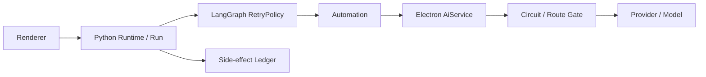
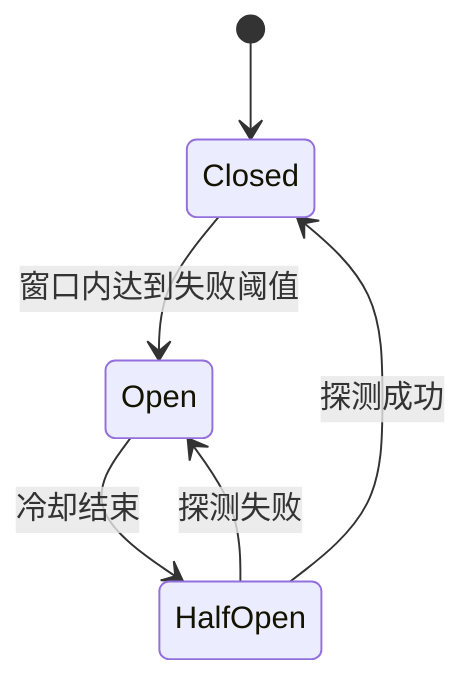

# Agent 网络重试、熔断、切换与任务恢复设计

状态：评审草案 v0.2  
日期：2026-07-20  
适用范围：Electron AI Provider、Automation、Python Agent Runtime、Toolchain、多 Agent Supervisor、SSE 活动流与 Agent Renderer。

## 1. 背景

当前长模型请求可能因网关 `504`、限流、连接重置或临时不可用而失败。失败后用户输入“重试”或“继续”，现有会话可能把它当作新目标，再次生成计划。这会带来三个问题：

- 已审批的计划、章节范围和专家选择被重复生成。
- 已完成的读取、专家报告或草稿步骤可能被重复执行。
- 用户无法判断系统是在恢复原任务，还是发起了一个新任务。

网络瞬时失败是常见产品场景。系统需要把自动重试、熔断、Provider/模型切换、Run 恢复和副作用对账分成不同层级，避免每层各自重试造成请求放大。

## 2. 目标

- 可重试网络错误默认自动重试 3 次，耗尽后才向用户报告失败。
- 自动重试期间不生成新计划、不新增聊天气泡、不重复审批。
- 用户在最终失败后输入“继续”“重试”“再试一次”时，默认恢复原计划的失败节点。
- 熔断阻止已知故障 Provider 被多 Run、多专家同时反复请求。
- 支持显式配置的 Provider/模型后备路由，但不静默改变用户模型。
- 多 Agent 只重试失败专家，成功专家和共享章节读取不重复执行。
- 所有写操作继续遵守调用账本；结果未知时禁止自动重放。
- Renderer 可展示简明进度，展开后才显示请求、重试、切换与恢复明细。

## 3. 非目标

- 本方案不保证模型输出在重试后逐字一致。
- 本方案不把所有业务错误都包装成网络重试。
- 本方案不允许绕过草稿审核、报告审批或副作用对账。
- 本方案不在未配置后备路由时自动选择任意模型。
- 本阶段先完成协议与后端设计；所有 Renderer 变更必须先经过 Stitch 原型评审。

## 4. 术语与默认口径

### 4.1 默认重试次数

本草案按“重试 3 次”的产品口径定义：

- 首次请求不计入重试次数。
- 首次失败后最多自动重试 3 次。
- 因此单个逻辑模型请求最多产生 4 次网络尝试。
- LangGraph 的 `max_attempts` 包含首次请求，因此配置为 `max_attempts=4`。
- UI 显示“正在重试 1/3”至“正在重试 3/3”。

3 次重试是上限，不是必须完成三次的承诺。用户取消、不可重试错误、总时限耗尽、熔断或副作用不确定会提前停止。代码、事件和 UI 必须统一使用“首次请求 + 最多 3 次重试”的口径。

### 4.2 三种不同的重试

| 层级 | 触发时机 | 责任方 | 是否创建新 Run |
| --- | --- | --- | --- |
| 节点级自动重试 | Agent 图中的模型/只读网络节点瞬时失败 | LangGraph `RetryPolicy` | 否 |
| Run 级恢复 | LangGraph 自动重试耗尽，用户选择继续 | Python Runtime | 是，关联原 Run |
| 副作用恢复 | 写请求结果未知 | 调用账本与人工对账 | 否，先对账，禁止重发 |

## 5. 核心原则：每一层只有一个重试责任人



- Agent Runtime 内的模型与只读网络节点使用 LangGraph `RetryPolicy`，由它负责 3 次自动重试、指数退避和失败节点重执行。
- Electron `AiService` 每次 LangGraph attempt 只派发一次 Provider 请求，负责结构化错误、取消、熔断、限流门禁和可选后备路由，不再叠加默认重试循环。
- Automation 只传递 deadline、取消信号、请求标识和结构化错误，不对同一调用额外重试。
- Python Runtime 在 LangGraph 重试耗尽后结束当前 Run；只有用户或明确恢复策略才能创建关联恢复 Run。
- 不经过 Agent 图的现有直连 AI 功能可以使用共享重试执行器，但一次调用只能声明一个 `retryOwner`，禁止与 LangGraph 嵌套。
- `PythonRuntimeClient` 的本地进程启动恢复与 Provider 网络重试分开计算。
- SSE 重连只恢复事件订阅，不重新执行任务。
- 写工具只由持久化调用账本决定能否重发。

当前 `HttpProvider` 在 `net.fetch` 抛错后回退到全局 `fetch` 的行为需要退出。请求一旦可能已发送，就不能用另一套 transport 隐式再发一次。transport 应在派发前选定，后续尝试全部由统一重试策略记录。

当前 `PlanExecutionGraph` 把多个操作包在单个 `advance` 节点中，`ExplorationGraph` 还会把工具异常转换成普通 observation。落地 RetryPolicy 前必须把模型调用、只读工具、专家任务和副作用拆为可独立检查点的细粒度节点或 `@task`，并让可重试异常继续向 LangGraph 抛出。不能直接给现有大 `advance` 节点套重试，否则可能重复事件、工具调用或已经完成的处理。

## 6. LangGraph 节点级自动重试

### 6.1 默认策略

```python
RetryPolicy(
    max_attempts=4,       # 首次请求 + 3 次重试
    initial_interval=1.0,
    backoff_factor=2.0,
    max_interval=30.0,
    jitter=True,
    retry_on=is_retryable_agent_error,
)
```

默认退避使用 LangGraph 指数退避和 jitter。三次重试的基准等待窗口为 `1s / 2s / 4s`，最大不超过 30 秒。服务端返回合法 `Retry-After` 时，Electron 限流门禁记录最早可再次派发时间；LangGraph 后续 attempt 到达门禁时可取消地等待，但单次最多等待 120 秒。

取消操作必须同时中止当前 HTTP 请求、限流等待和 LangGraph Run。被取消的请求不再重试，也不计为失败。

### 6.2 可重试错误

- DNS 临时失败、连接超时、连接重置、TLS 临时中断、socket 提前关闭。
- HTTP `408`、`425`、`429`、`500`、`502`、`503`、`504`。
- 网关返回非 2xx HTML 错误页。
- 响应在正文完成前中断，且系统尚未向上层发布任何可用模型结果。
- 明确标记为 `retryable=true` 的 Provider 临时不可用错误。

### 6.3 不可重试错误

- HTTP `400`、`401`、`403`、`404`、`405`、`409`、`413`、`415`、`422`。
- 内容安全、版权、敏感内容或供应商策略拒绝。
- JSON/Schema 校验失败。此类问题进入有界的结构化修复流程，不消耗网络重试配额。
- 用户取消、章节版本冲突、无效 `volumeId/chapterId`、工具权限不足。
- `SIDE_EFFECT_UNKNOWN`。
- 已向上层发布部分流式正文后发生的断线；除非供应商支持 request ID 续传，否则不得自动从头生成。

### 6.4 超时预算

LangGraph 节点重试次数与总操作时限同时生效，先到者终止：

- 普通聊天、意图判断和计划：建议总时限 5 分钟。
- 长报告、范围审核、章节草稿和团队综合：建议总时限 10 分钟。
- 单次尝试继续使用能力或 Tool manifest 声明的 timeout，但不得超过剩余总时限。
- 单次 attempt 的时限顺序固定为 `Provider request < Automation method < LangGraph node`，整个 Run 另有总 deadline；同一个取消信号必须贯穿各层，不能只用 `Promise.race` 返回超时。
- 每次尝试都记录耗时、Token 与估算成本；到达用户配置的成本上限时停止重试并返回 `RETRY_COST_LIMIT`。

这避免当前 180 至 270 秒外层窗口在内部请求完成前先行超时，也避免把单次 210 秒超时机械乘以 4。

### 6.5 结构化错误

对上层只返回可展示的规范化错误，不透传 HTML、响应头、API key 或完整 Provider body：

```ts
type AgentRequestFailure = {
  code:
    | 'NETWORK_ERROR'
    | 'PROVIDER_TIMEOUT'
    | 'PROVIDER_RATE_LIMITED'
    | 'PROVIDER_UNAVAILABLE'
    | 'PROVIDER_AUTH'
    | 'RETRY_BUDGET_EXHAUSTED'
    | 'RETRY_COST_LIMIT'
    | 'CANCELLED';
  retryable: boolean;
  attempts: number;
  httpStatus?: number;
  providerProfileId: string;
  model: string;
  requestId: string;
  userMessage: string;
  diagnosticRef: string;
};
```

用户看到“模型服务暂时不可用，已重试 3 次”，诊断区可通过 `diagnosticRef` 查看脱敏信息；不得显示截图中的原始 `HTTP 504: <html>...`。

## 7. 熔断器

### 7.1 熔断范围

熔断键固定为：

```text
providerType + baseUrl + apiMode + model + credentialProfileId
```

某个模型故障不能熔断其他 Provider、其他模型或本地 Runtime。熔断状态必须由长生命周期的 `AiService` 共享，不能放在每次请求新建的 Provider 实例中。

### 7.2 状态机



建议默认值：

- 60 秒内 3 个逻辑请求均重试耗尽，或 120 秒内累计 10 次可重试网络失败，进入 `Open`。
- 初始冷却 30 秒；再次失败后依次为 60、120、240 秒，最大 300 秒。
- `HalfOpen` 只允许一个共享探测请求，其余请求排队或快速失败，防止多 Agent 同时探测。
- 用户点击“立即重试”最多触发一次半开探测，不会绕过副作用保护。
- `401/403` 不进入临时熔断，而是进入配置锁定；设置或凭据变更前直接失败。
- `429` 使用独立限流窗口并尊重 `Retry-After`，避免与普通故障混淆。

## 8. Provider 与模型切换

### 8.1 默认行为

- 自动切换默认关闭。
- 只有用户配置并批准有序后备路由后，系统才能切换。
- 路由选择发生在每次 LangGraph attempt 派发前；主路由连续失败达到配置阈值或对应熔断器已打开时，后续 attempt 才允许使用已批准的后备路由。
- 不在一次流式响应中途切换模型。
- 不因 `401/403`、内容安全拒绝或无效请求自动切换。

建议新增：

```ts
type AiRouteProfile = {
  routeId: string;
  primary: AiRouteTarget;
  fallbacks: AiRouteTarget[];
  automaticFailover: boolean;
  requiredCapabilities: string[];
  maxTotalCost?: number;
};
```

切换前必须校验上下文窗口、JSON Schema、工具调用、图片或流式能力是否兼容。ContextBuilder 按实际后备模型重新计算 Token 预算，但不能扩大章节范围。Artifact、Run 和活动明细必须记录实际使用的 Provider 与模型。

主路由与后备路由共享同一个 LangGraph `max_attempts=4`、总 deadline 和总成本，不因切换而重置重试次数。例如前三次使用主路由、第四次切换到后备路由，整个逻辑请求仍最多派发 4 次。默认最多切换 1 次，禁止形成环路。

## 9. LangGraph 重试耗尽后的 Run 级恢复

### 9.1 用户默认行为

最新 Run 因可重试错误失败，且用户没有提出新目标、修改章节范围或变更交付物时：

- “继续”“重试”“再试一次”由 IntentService 解析为 `retry_failed_run`。
- 不进入 Planner，不创建新计划草稿。
- 创建新的关联 Run，保留原计划、审批、章节范围和上下文快照。
- 从失败节点继续；已完成节点只在依赖快照过期时重新执行。

建议新增接口：

```text
agent.retry_run
```

```ts
type RetryRunRequest = {
  failedRunId: string;
  expectedFailureRevision: number;
  mode: 'failed_node' | 'failed_experts' | 'rebuild_context';
};
```

原 Run 保持不可变终态，新 Run 保存：

- `retryOfRunId`
- `retryAttempt`
- 原 `planId` 与 plan revision
- 原 `scopeId`、章节 version/contentHash 快照
- 原审批决定、Artifact 与 DraftBatch 引用
- 恢复节点和失败分类

### 9.2 何时必须重新规划

只有以下情况才生成新计划：

- 用户明确改变目标、角色、交付物或章节范围。
- 章节版本或内容哈希变化，使原计划依赖失效。
- Toolchain 版本已退出或能力契约不兼容。
- 原失败属于输入校验、权限或不支持能力，重试不能解决。
- 用户明确选择“调整后重新规划”。

失败卡建议提供：

- 主操作：`重试失败步骤`
- 次操作：`调整并重新规划`
- `SIDE_EFFECT_UNKNOWN` 时只显示：`检查执行结果`

相同计划和范围的恢复不重复计划审批；新增副作用权限或扩大范围时必须重新审批。

## 10. 多 Agent 与 Supervisor 重试

### 10.1 基础规则

- `ChapterScopeBundle` 只装配一次，并以 scope snapshot 复用。
- 每个专家具有稳定 `expertExecutionKey`、attempt、状态和 Artifact 引用。
- 只重试失败专家；成功专家不得因为另一专家失败而重新调用。
- 等待退避的专家不占用并发槽；重新开始时进入同一队列，继续遵守最大并发 2。
- Provider 熔断打开后，所有专家共享熔断结果，不能形成请求风暴。
- 取消团队 Run 时同时取消在途请求、排队专家和重试计时器。

### 10.2 各子链规则

| 子链 | 恢复粒度 | 必须保留的状态 |
| --- | --- | --- |
| 编辑 | 失败批次或综合节点 | 已完成批次 finding、范围覆盖率 |
| 世界观 | 失败批次或综合节点 | 已完成规则核对与 evidence 引用 |
| 考据 | 搜索、声明核验、综合分别恢复 | 已提取声明、已有搜索命中、来源 ID |
| 读者 | 当前章节评估 | 前章读者状态与评估；禁止跳章、并发或读取未来章节 |
| Supervisor | 仅综合节点 | 全部已发布专家子 Artifact；不得重跑专家 |

### 10.3 部分成功

计划中需声明 `requiredExperts` 与 `optionalExperts`：

- 可选专家重试耗尽：生成 `partial` 综合报告，明确缺失专家和覆盖率，允许之后单独重试失败专家。
- 必选专家重试耗尽：Run 进入 `failed` 或 `partial_waiting_user`，由用户选择重试、移除专家并重新审批，或结束。
- 全部专家失败：不允许 Supervisor 生成看似完整的报告。
- Supervisor 重试只能读取既有子 Artifact，不能伪造或补写未执行专家结论。

## 11. 副作用、草稿和重复执行

- `chapter.save`、`draft.commit`、草稿批次生成等账本保护调用继续使用稳定 invocation key。
- 请求发送后无法确认结果时标记 `SIDE_EFFECT_UNKNOWN`，自动重试、Provider 切换和 Run 恢复全部停止。
- 用户完成 `agent.inspect_side_effect` / `agent.reconcile_side_effect` 后，才允许继续原 Run 或批次重生成。
- 多章草稿继续使用 `draftBatchId + childIndex + generationRevision` 对账；恢复不得创建重复子 DraftSession。
- 报告 Artifact 发布使用稳定 Artifact key；响应丢失后优先查询既有 Artifact，不重复发布。
- 流式正文已部分可见但尚未形成可对账草稿时，状态标记为 `partial_output_unknown`，不得静默覆盖。

## 12. 其他相同问题场景

| 场景 | 默认策略 | 与模型重试的区别 |
| --- | --- | --- |
| SSE 断线 | 指数退避重连并携带 `afterSequence` | 只恢复订阅，不重新执行 Run |
| Python Runtime 启动失败 | 共享启动 Promise，有界重启一次 | 本地进程恢复，不计入 LangGraph 3 次重试 |
| MCP CLI 崩溃/超时 | 默认最多重启 2 次，保留 stderr 诊断 | 进程可能已有部分输出，不能照搬 HTTP 策略 |
| RAG/Embedding 网络调用 | 只读请求使用统一重试与熔断 | hash fallback 必须显式记录为降级 |
| 搜索/外部资料源 | GET/只读可重试；写入走调用账本 | 受第三方限流和 `Retry-After` 控制 |
| 图片生成 | 支持有界重试，但优先使用供应商 request ID | 可能重复计费，默认可覆盖为更低次数 |
| JSON/Schema 解析失败 | 最多 1 至 2 次结构化修复 | 不消耗网络重试次数 |
| SQLite busy/事务锁 | 短退避重试 | version/hash 冲突不可重试 |
| 应用离线 | 快速进入离线熔断，监听网络恢复后半开探测 | 不应让每个专家各自等待完整三次 |
| 设置切换 | 新请求使用新配置；旧请求保持原路由或取消 | 不允许运行中无审计地改模型 |

## 13. 事件与活动流

建议新增事件：

- `request_retry_scheduled`
- `request_retry_started`
- `request_retry_succeeded`
- `request_retry_exhausted`
- `circuit_opened`
- `circuit_half_open`
- `circuit_closed`
- `provider_switched`
- `run_retry_started`
- `expert_retry_started`

事件必须包含 `runId`、`stepId/nodeId`、`requestId`、attempt、最大次数、错误码、脱敏 Provider/模型、下一次等待时间和时间戳。

会话中只保留一个原位更新的活动摘要：

- `正在连接模型...`
- `网络波动，正在重试 2/3`
- `主模型暂不可用，正在切换到已配置的后备模型`
- `编辑专家失败，其他专家继续；稍后将重试`
- `已重试 3 次，任务暂停`

点击展开后显示每次尝试、HTTP 状态、耗时、熔断和切换记录。不得展示隐藏提示词、思维过程、API key、完整响应正文或原始 HTML。

所有上述 Renderer 状态必须先在 Stitch 覆盖主流程、退避中、取消、重试耗尽、熔断、切换、团队部分成功、窄窗口和刷新恢复，再进入前端实现。

## 14. 持久化与观测

请求尝试至少记录：

```ts
type RequestAttemptRecord = {
  requestId: string;
  operationId: string;
  runId?: string;
  stepId?: string;
  expertId?: string;
  attempt: number;
  providerProfileId: string;
  model: string;
  startedAt: string;
  completedAt?: string;
  outcome: 'succeeded' | 'failed' | 'cancelled' | 'skipped_by_circuit';
  errorCode?: string;
  httpStatus?: number;
  retryDelayMs?: number;
  tokenUsage?: number;
  estimatedCost?: number;
};
```

- 日志和数据库只保存脱敏摘要，Provider 原始错误进入受限诊断日志并做长度限制。
- 可按 Provider、模型、错误码观察成功率、重试后恢复率、熔断次数、P95 延迟和额外成本。
- `requestId` 在 Electron、Automation、Runtime 事件中保持一致，便于定位一次逻辑请求。
- 对“首次 + 3 次”建立请求放大率告警，避免配置错误造成 `4 × Toolchain × Agent` 放大。

## 15. 验收场景

1. 前三次网络尝试返回 `504`、第四次成功：只生成一个回答或 Artifact，不生成新计划，活动流显示恢复成功。
2. 首次请求与三次重试均失败：只出现一个规范化失败卡，不显示 HTML；attempt 记录完整。
3. 用户在上述失败后输入“继续”：创建关联恢复 Run，沿用原计划并从失败节点开始。
4. 用户修改章节范围后输入“继续”：不恢复旧节点，必须重新规划和审批。
5. `429` 带 `Retry-After`：按服务端时间退避，取消可立即终止等待。
6. 退避期间刷新 Renderer：SSE 重放后仍显示正确 attempt 和下一次重试状态。
7. 达到熔断阈值：后续请求快速失败或排队，只有一个半开探测请求。
8. 配置后备模型：主模型耗尽后只切换一次，Artifact 记录实际模型；未配置时绝不静默切换。
9. 团队中编辑失败、其他专家成功：只重试编辑，共享上下文和成功专家不重新调用。
10. 读者评估第 N 章失败：只重试第 N 章，保留此前状态，输入中不存在未来章节关键词。
11. Supervisor 综合失败：只重试综合，不重新调用任何专家。
12. 草稿请求结果未知：不自动重试、不切换 Provider，必须先人工对账。
13. SSE 重连和 Runtime 重启不会额外消耗模型重试次数。
14. Automation 外层超时会真正向底层传播取消，不留下迟到回答或 Artifact。
15. 全链路不存在嵌套默认重试；单个逻辑请求的网络尝试数可证明且不超过 4。

## 16. 建议实施顺序

### P0：先解决当前问题

1. 统一错误分类和脱敏，移除隐式 transport 二次派发。
2. 拆分现有大 `advance`/专家执行单元，在模型与只读网络节点落地 LangGraph `RetryPolicy(max_attempts=4)`、节点超时和尝试事件。
3. `AiService` 改为单次派发并落地错误分类、熔断/限流门禁；对齐 LangGraph、Automation 与 Provider 超时并让取消信号贯穿到底层。
4. 新增 `agent.retry_run`、失败 checkpoint 和 `retry_failed_run` Intent。
5. 失败卡与活动摘要先完成 Stitch 原型，再实现“重试失败步骤/调整并重新规划”。

### P1：并发可靠性

1. 落地按路由隔离的熔断器。
2. 落地多 Agent 专家级重试、读者顺序恢复和 Supervisor 单独恢复。
3. 补齐请求尝试持久化、指标和请求放大防护。

### P2：后备路由

1. 设计 Provider/模型后备路由设置与能力兼容检查。
2. 先完成 Stitch 设置页和活动流原型，再实现自动切换。
3. 扩展到 RAG、搜索、Embedding、图片和 MCP CLI 的能力级策略。

## 17. 本轮评审项与推荐默认值

| 决策 | 推荐值 |
| --- | --- |
| “重试 3 次”口径 | 首次请求 + 3 次重试，LangGraph `max_attempts=4`，最多 4 次网络尝试 |
| 退避 | LangGraph 1/2/4 秒指数窗口 + jitter；Electron 限流门禁尊重 `Retry-After` |
| 普通任务总时限 | 5 分钟 |
| 长报告/草稿总时限 | 10 分钟 |
| 熔断阈值 | 60 秒内 3 个逻辑请求耗尽，或 120 秒 10 次网络失败 |
| 熔断冷却 | 30 秒起，指数增长，最多 300 秒 |
| 自动切换 | 默认关闭；用户配置后最多切换 1 次 |
| 最终失败后的“继续” | 沿用原计划，新建关联 Run，从失败节点恢复 |
| 多 Agent | 只重试失败专家；Supervisor 只重试综合 |
| 副作用未知 | 永不自动重试，必须先对账 |
