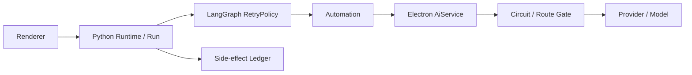
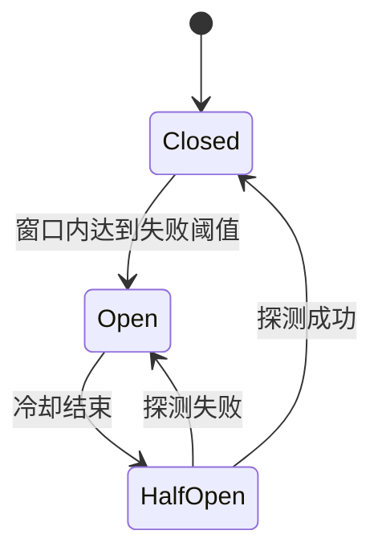

# Agent 运行韧性、重试、降级与任务恢复需求

状态：已确认 v0.6

日期：2026-08-04

适用范围：Electron AI Provider、Automation、Python Agent Runtime、Toolchain、多 Agent Supervisor、SSE 活动流与 Agent Renderer。

## 1. 背景

当前长模型请求可能因网关 `504`、限流、连接重置或临时不可用而失败。失败后用户输入“重试”或“继续”，现有会话可能把它当作新目标，再次生成计划。这会带来三个问题：

- 已审批的计划、章节范围和专家选择被重复生成。
- 已完成的读取、专家报告或草稿步骤可能被重复执行。
- 用户无法判断系统是在恢复原任务，还是发起了一个新任务。

网络瞬时失败是常见产品场景。系统需要把自动重试、熔断、Provider/模型切换、Run 恢复和副作用对账分成不同层级，避免每层各自重试造成请求放大。

当前还存在一类影响更大的失败：模型已经完成回答，程序却在本地解析、Schema 校验、领域对象转换、Artifact 发布、最终报告装配或状态投影阶段失败。例如字段重命名后仍访问旧属性，或模型返回的列表元素与 Pydantic 领域模型不一致。此时再次请求模型通常没有必要，但现有流程会把 Run 直接置为 `failed`，并将审核入口和接受/暂缓/驳回按钮一并禁用；后端又只允许带 `request_retry_exhausted` 事件的 Run 调用恢复接口，最终迫使用户发送“重试”来启动一项新任务。

上述现象不是某个 Toolchain 的单点缺陷。本需求将“模型请求成功后的本地处理”纳入统一运行韧性契约，覆盖聊天、计划、范围审核、多 Agent 综合、报告生成、修订批次、章节草稿和 Artifact 发布等所有流程。

## 2. 目标

- 可重试网络错误默认自动重试 3 次，耗尽后才向用户报告失败。
- 自动重试期间不生成新计划、不新增聊天气泡、不重复审批。
- 用户在最终失败后输入“继续”“重试”“再试一次”时，默认恢复原计划的失败节点。
- 熔断阻止已知故障 Provider 被多 Run、多专家同时反复请求。
- 支持显式配置的 Provider/模型后备路由，但不静默改变用户模型。
- 多 Agent 只重试失败专家，成功专家和共享章节读取不重复执行。
- 所有写操作继续遵守调用账本；结果未知时禁止自动重放。
- Renderer 可展示简明进度，展开后才显示请求、重试、切换与恢复明细。
- 模型结果一旦完整返回，必须先形成可恢复 checkpoint；后续本地失败默认优先复用该结果，不重新调用模型。
- 任何可安全恢复的失败都必须提供直接操作入口，不能要求用户通过发送“重试”重新触发任务。
- Run、步骤和 Artifact 分别表达执行状态；父 Run 后续失败不能取消已完成、未过期 Artifact 的查看和审核能力。
- 可独立成立的部分结果允许降级发布，并明确覆盖率、缺失项和恢复入口，避免单个尾部综合节点阻塞全部结果。

## 3. 非目标

- 本方案不保证模型输出在重试后逐字一致。
- 本方案不把所有业务错误都包装成网络重试。
- 本方案不允许绕过草稿审核、报告审批或副作用对账。
- 本方案不在未配置后备路由时自动选择任意模型。
- 本方案不把 Schema 校验放宽为无条件接受未知结构；结构不合法时必须修复、降级或明确失败。
- 本方案不保证任意程序缺陷都能自动修复，但要求缺陷不能无条件抹掉已保存的模型结果和已就绪产物。
- 本次不做失败卡和审核面板的整体视觉重设计；恢复入口复用现有任务卡、活动卡和审核面板。

### 3.1 v0.6 本次落地范围

本次实现聚焦“模型已经返回、流程死在本地程序中”的闭环，不把整份运行韧性规划一次性扩成大规模基础设施重写：

- 结构化 Agent 响应在解析前保存原文、契约版本、修复 revision 和内容哈希。
- 所有已注册结构化 Agent 方法执行统一契约校验；业务 JSON 不与 JSON-RPC 传输层混淆。
- 非法 JSON/Schema 不匹配自动修复一次；仍失败后显示一次“修复结果并继续”；再次失败后只读流程可直接“重新生成本步骤”。JSON/Schema 仅作为内部诊断术语，不进入主操作文案。
- 深层 Pydantic/领域模型校验复用同一恢复器，不允许 Electron 校验通过后在 Python 中无恢复地终止。
- 本地 `AttributeError`、`KeyError`、`TypeError` 等程序缺陷保存原始结果，但同一处理器版本不显示必然失败的按钮；处理器版本变化后显示“继续处理已保存结果”，且不调用原创作模型。
- 终态恢复创建关联 Run；失败 Run 不重新改回 `running`，恢复版本和按钮状态持久化并可在刷新/重启后恢复。
- 父 Run 失败或取消不再禁用已 `ready`、未过期 Artifact 的审核操作。
- 计划卡中的“会话背景”默认折叠，仅在用户点击“查看会话背景”后展开。
- 计划创建前的普通聊天也属于结构化恢复边界，不能因为尚未创建 Run 而跳过自动修复或直接恢复入口。
- `agent.chat.response@1.0.0` 的 `inputRequest` 明确接受 `object | null`；`null` 表示无需用户补充输入，不能被结构校验误报。
- 聊天结构校验失败时自动修复 1 次；若仍失败，Runtime 持久化后端恢复记录，Renderer 只保存不透明 `recoveryRef` 并显示“修复结果并继续”。
- 用户点击聊天恢复按钮后先以当前契约重处理已保存结果；仍不合法时才执行第 2 次 JSON 修复。第 2 次失败后按钮切换为“重新生成回答”，不继续形成修复循环。
- 旧失败记录若没有恢复引用，允许在同一用户消息上直接重新请求模型；不得重复追加用户消息，也不得要求用户发送“重试”。

`resume_publish`、完整的副作用对账 UI、Provider 后备路由管理、所有 Toolchain 的确定性部分发布策略和模型结果生命周期清理仍按本文后续章节实施，不属于本次闭环的完成条件。

## 4. 术语与默认口径

### 4.1 默认重试次数

本草案按“重试 3 次”的产品口径定义：

- 首次请求不计入重试次数。
- 首次失败后最多自动重试 3 次。
- 因此单个逻辑模型请求最多产生 4 次网络尝试。
- LangGraph 的 `max_attempts` 包含首次请求，因此配置为 `max_attempts=4`。
- UI 显示“正在重试 1/3”至“正在重试 3/3”。

3 次重试是上限，不是必须完成三次的承诺。用户取消、不可重试错误、总时限耗尽、熔断或副作用不确定会提前停止。代码、事件和 UI 必须统一使用“首次请求 + 最多 3 次重试”的口径。

### 4.2 三种不同的重试

| 层级 | 触发时机 | 责任方 | 是否创建新 Run |
| --- | --- | --- | --- |
| 节点级自动重试 | Agent 图中的模型/只读网络节点瞬时失败 | LangGraph `RetryPolicy` | 否 |
| Run 级恢复 | LangGraph 自动重试耗尽，用户选择继续 | Python Runtime | 是，关联原 Run |
| 副作用恢复 | 写请求结果未知 | 调用账本与人工对账 | 否，先对账，禁止重发 |

### 4.3 运行阶段与可恢复边界

一次逻辑节点必须显式经过以下阶段，不能只用 `running/failed/completed` 概括全过程：

```text
model_pending
  -> model_received
  -> normalizing
  -> publishing
  -> completed
```

- `model_received`：完整原始模型结果及调用元数据已经持久化。进入此状态后，网络请求视为成功。
- `normalizing`：执行 JSON 提取、Schema 修复、Pydantic/TypeScript 校验、字段映射、去重和领域转换。
- `publishing`：以稳定键写入 Artifact、DraftSession、报告、事件和 UI 投影。
- 任一阶段失败时都必须保存 `failedAtPhase`、结构化失败类型和最近可用 checkpoint。
- 重试的最小单位是失败阶段，不是整个 Run。只有现有 checkpoint 无法满足恢复前置条件时，才允许回退到更早阶段。

“可重试”在本文中包括三类不同动作：重新请求外部服务、复用已保存结果重新处理、从稳定写入点继续发布。协议不得再用单个 `retryable: boolean` 或是否出现 `request_retry_exhausted` 来推断具体恢复动作。

## 5. 核心原则：每一层只有一个重试责任人



- Agent Runtime 内的模型与只读网络节点使用 LangGraph `RetryPolicy`，由它负责 3 次自动重试、指数退避和失败节点重执行。
- Electron `AiService` 每次 LangGraph attempt 只派发一次 Provider 请求，负责结构化错误、取消、熔断、限流门禁和可选后备路由，不再叠加默认重试循环。
- Automation 只传递 deadline、取消信号、请求标识和结构化错误，不对同一调用额外重试。
- Python Runtime 在 LangGraph 重试耗尽后结束当前 Run；只有用户或明确恢复策略才能创建关联恢复 Run。
- 不经过 Agent 图的现有直连 AI 功能可以使用共享重试执行器，但一次调用只能声明一个 `retryOwner`，禁止与 LangGraph 嵌套。
- `PythonRuntimeClient` 的本地进程启动恢复与 Provider 网络重试分开计算。
- SSE 重连只恢复事件订阅，不重新执行任务。
- 写工具只由持久化调用账本决定能否重发。

当前 `HttpProvider` 在 `net.fetch` 抛错后回退到全局 `fetch` 的行为需要退出。请求一旦可能已发送，就不能用另一套 transport 隐式再发一次。transport 应在派发前选定，后续尝试全部由统一重试策略记录。

当前 `PlanExecutionGraph` 把多个操作包在单个 `advance` 节点中，`ExplorationGraph` 还会把工具异常转换成普通 observation。落地 RetryPolicy 前必须把模型调用、只读工具、专家任务和副作用拆为可独立检查点的细粒度节点或 `@task`，并让可重试异常继续向 LangGraph 抛出。不能直接给现有大 `advance` 节点套重试，否则可能重复事件、工具调用或已经完成的处理。

## 6. LangGraph 节点级自动重试

### 6.1 默认策略

```python
RetryPolicy(
    max_attempts=4,       # 首次请求 + 3 次重试
    initial_interval=1.0,
    backoff_factor=2.0,
    max_interval=30.0,
    jitter=True,
    retry_on=is_retryable_agent_error,
)
```

默认退避使用 LangGraph 指数退避和 jitter。三次重试的基准等待窗口为 `1s / 2s / 4s`，最大不超过 30 秒。服务端返回合法 `Retry-After` 时，Electron 限流门禁记录最早可再次派发时间；LangGraph 后续 attempt 到达门禁时可取消地等待，但单次最多等待 120 秒。

取消操作必须同时中止当前 HTTP 请求、限流等待和 LangGraph Run。被取消的请求不再重试，也不计为失败。

### 6.2 可重试错误

- DNS 临时失败、连接超时、连接重置、TLS 临时中断、socket 提前关闭。
- HTTP `408`、`425`、`429`、`500`、`502`、`503`、`504`。
- 网关返回非 2xx HTML 错误页。
- 响应在正文完成前中断，且系统尚未向上层发布任何可用模型结果。
- 明确标记为 `retryable=true` 的 Provider 临时不可用错误。

### 6.3 不可重试错误

- HTTP `400`、`401`、`403`、`404`、`405`、`409`、`413`、`415`、`422`。
- 内容安全、版权、敏感内容或供应商策略拒绝。
- JSON/Schema 校验失败。此类问题进入有界的结构化修复流程，不消耗网络重试配额。
- 用户取消、章节版本冲突、无效 `volumeId/chapterId`、工具权限不足。
- `SIDE_EFFECT_UNKNOWN`。
- 已向上层发布部分流式正文后发生的断线；除非供应商支持 request ID 续传，否则不得自动从头生成。

### 6.4 超时预算

LangGraph 节点重试次数与总操作时限同时生效，先到者终止：

- 普通聊天、意图判断和计划：建议总时限 5 分钟。
- 长报告、范围审核、章节草稿和团队综合：建议总时限 10 分钟。
- 单次尝试继续使用能力或 Tool manifest 声明的 timeout，但不得超过剩余总时限。
- 单次 attempt 的时限顺序固定为 `Provider request < Automation method < LangGraph node`，整个 Run 另有总 deadline；同一个取消信号必须贯穿各层，不能只用 `Promise.race` 返回超时。
- 每次尝试都记录耗时、Token 与估算成本；到达用户配置的成本上限时停止重试并返回 `RETRY_COST_LIMIT`。

这避免当前 180 至 270 秒外层窗口在内部请求完成前先行超时，也避免把单次 210 秒超时机械乘以 4。

### 6.5 结构化错误

对上层只返回可展示的规范化错误，不透传 HTML、响应头、API key 或完整 Provider body：

```ts
type AgentRequestFailure = {
  code:
    | 'NETWORK_ERROR'
    | 'PROVIDER_TIMEOUT'
    | 'PROVIDER_RATE_LIMITED'
    | 'PROVIDER_UNAVAILABLE'
    | 'PROVIDER_AUTH'
    | 'RETRY_BUDGET_EXHAUSTED'
    | 'RETRY_COST_LIMIT'
    | 'CANCELLED';
  retryable: boolean;
  attempts: number;
  httpStatus?: number;
  providerProfileId: string;
  model: string;
  requestId: string;
  userMessage: string;
  diagnosticRef: string;
};
```

用户看到“模型服务暂时不可用，已重试 3 次”，诊断区可通过 `diagnosticRef` 查看脱敏信息；不得显示截图中的原始 `HTTP 504: <html>...`。

请求失败只描述外部调用阶段。Runtime 还必须使用独立的执行恢复描述，避免把本地转换异常伪装成网络错误：

```ts
type AgentRecoveryDescriptor = {
  failureKind:
    | 'transport'
    | 'model_output_invalid'
    | 'local_transform_failed'
    | 'artifact_publish_failed'
    | 'persistence_failed'
    | 'side_effect_unknown';
  failedAtPhase: 'model_pending' | 'model_received' | 'normalizing' | 'publishing';
  retryStrategy:
    | 'retry_request'
    | 'repair_model_output'
    | 'reprocess_saved_result'
    | 'resume_publish'
    | 'reconcile_side_effect'
    | 'none';
  canRecover: boolean;
  recoveryRevision: number;
  actionLabel?: string;
  blockedReason?: 'processor_update_required' | 'stale_dependency' | 'unsafe_side_effect' | 'repair_exhausted';
  completedArtifactIds: string[];
  affectedArtifactIds: string[];
  diagnosticRef: string;
};
```

`model_output_invalid` 表示原始结果已完整收到但不符合输出契约，不属于网络失败。它可以进入有界结构化修复；`local_transform_failed` 表示输入可能有效但本地程序处理异常，必须保留原始结果，并且只在处理器版本变化、存在兼容转换器或瞬时前置条件已经恢复时允许重新处理。相同 `resultHash + nodeId + processorVersion + failureFingerprint` 不得循环执行同一处理器。

Renderer 只接收上述公开描述，不接收 `modelResultRef`、checkpoint、结果哈希、异常指纹或内部处理器版本。用户界面只显示短错误摘要和可执行恢复动作，Pydantic traceback、内部对象名和完整模型正文只进入受限诊断。

## 7. 熔断器

### 7.1 熔断范围

熔断键固定为：

```text
providerType + baseUrl + apiMode + model + credentialProfileId
```

某个模型故障不能熔断其他 Provider、其他模型或本地 Runtime。熔断状态必须由长生命周期的 `AiService` 共享，不能放在每次请求新建的 Provider 实例中。

### 7.2 状态机



建议默认值：

- 60 秒内 3 个逻辑请求均重试耗尽，或 120 秒内累计 10 次可重试网络失败，进入 `Open`。
- 初始冷却 30 秒；再次失败后依次为 60、120、240 秒，最大 300 秒。
- `HalfOpen` 只允许一个共享探测请求，其余请求排队或快速失败，防止多 Agent 同时探测。
- 用户点击“立即重试”最多触发一次半开探测，不会绕过副作用保护。
- `401/403` 不进入临时熔断，而是进入配置锁定；设置或凭据变更前直接失败。
- `429` 使用独立限流窗口并尊重 `Retry-After`，避免与普通故障混淆。

## 8. Provider 与模型切换

### 8.1 默认行为

- 自动切换默认关闭。
- 只有用户配置并批准有序后备路由后，系统才能切换。
- 路由选择发生在每次 LangGraph attempt 派发前；主路由连续失败达到配置阈值或对应熔断器已打开时，后续 attempt 才允许使用已批准的后备路由。
- 不在一次流式响应中途切换模型。
- 不因 `401/403`、内容安全拒绝或无效请求自动切换。

建议新增：

```ts
type AiRouteProfile = {
  routeId: string;
  primary: AiRouteTarget;
  fallbacks: AiRouteTarget[];
  automaticFailover: boolean;
  requiredCapabilities: string[];
  maxTotalCost?: number;
};
```

切换前必须校验上下文窗口、JSON Schema、工具调用、图片或流式能力是否兼容。ContextBuilder 按实际后备模型重新计算 Token 预算，但不能扩大章节范围。Artifact、Run 和活动明细必须记录实际使用的 Provider 与模型。

主路由与后备路由共享同一个 LangGraph `max_attempts=4`、总 deadline 和总成本，不因切换而重置重试次数。例如前三次使用主路由、第四次切换到后备路由，整个逻辑请求仍最多派发 4 次。默认最多切换 1 次，禁止形成环路。

## 9. LangGraph 重试耗尽后的 Run 级恢复

### 9.1 用户默认行为

最新 Run 因可重试错误失败，且用户没有提出新目标、修改章节范围或变更交付物时：

- “继续”“重试”“再试一次”由 IntentService 解析为 `retry_failed_run`。
- 不进入 Planner，不创建新计划草稿。
- 创建新的关联 Run，保留原计划、审批、章节范围和上下文快照。
- 从失败节点继续；已完成节点只在依赖快照过期时重新执行。

建议新增接口：

```text
agent.retry_run
```

```ts
type RetryRunRequest = {
  failedRunId: string;
  expectedFailureRevision: number;
  mode: 'failed_node' | 'failed_experts' | 'rebuild_context';
};
```

原 Run 保持不可变终态，新 Run 保存：

- `retryOfRunId`
- `retryAttempt`
- 原 `planId` 与 plan revision
- 原 `scopeId`、章节 version/contentHash 快照
- 原审批决定、Artifact 与 DraftBatch 引用
- 恢复节点和失败分类

### 9.2 何时必须重新规划

只有以下情况才生成新计划：

- 用户明确改变目标、角色、交付物或章节范围。
- 章节版本或内容哈希变化，使原计划依赖失效。
- Toolchain 版本已退出或能力契约不兼容。
- 原失败属于输入校验、权限或不支持能力，重试不能解决。
- 用户明确选择“调整后重新规划”。

失败卡建议提供：

- 主操作：`重试失败步骤`
- 次操作：`调整并重新规划`
- `SIDE_EFFECT_UNKNOWN` 时只显示：`检查执行结果`

相同计划和范围的恢复不重复计划审批；新增副作用权限或扩大范围时必须重新审批。

### 9.3 模型已返回后的阶段恢复

模型已经返回时不得默认创建新计划或重新调用模型。Runtime 按以下顺序选择成本最低且不会扩大副作用的恢复方式：

| 失败位置 | 首选恢复动作 | 是否再次调用模型 | 是否创建新 Run |
| --- | --- | --- | --- |
| 原始结果无法解析为约定结构 | `repair_model_output`，自动 1 次、用户确认后再 1 次 | 是，只提交原始结果、目标 Schema 与短错误 | 自动修复留在当前 Run；手动修复创建关联 Run |
| Pydantic/TypeScript/领域对象转换异常 | 先区分输出契约错误与程序缺陷；前者修复输出，后者等待处理器变化 | 仅输出契约错误需要 | 终态后的恢复创建关联 Run |
| Artifact/报告/事件投影发布失败 | `resume_publish` | 否 | 创建关联 Run，按稳定发布键续写 |
| 数据库暂时锁定或进程重启 | 从 checkpoint 恢复当前阶段 | 否 | 终态后创建关联 Run |
| 外部写入结果未知 | `reconcile_side_effect` | 否 | 否；完成对账前禁止继续 |
| 模型结果缺失、损坏或无法修复 | `retry_request` | 是 | 可创建关联恢复 Run |

阶段恢复必须满足：

1. Electron 在解析前按 `requestId + attempt` 持久化原始模型响应，并生成内部 `modelResultRef`；记录版本化输出契约、Provider/模型、内容哈希和有界原始结果。Python 只保存引用、已解析 checkpoint 和恢复状态，不重复保存完整原文。
2. 每个结构化 Agent 方法必须注册稳定的 `contractId + contractVersion + JSON Schema`。模型负责修复业务 JSON payload；JSON-RPC 仅是 Automation 的传输协议，模型不得生成或修改 JSON-RPC envelope。
3. `reprocess_saved_result` 只能执行无外部副作用的确定性转换；仅当处理器版本变化、存在不同兼容转换器或瞬时前置条件恢复后才允许。处理器版本相同且失败指纹不变时设置 `retryStrategy=none`。
4. `resume_publish` 使用稳定的 Artifact key、事件去重键和数据库唯一约束；重复点击不会产生重复报告、草稿或活动项。
5. `repair_model_output` 先自动执行一次；仍失败时保留原结果并提供一次“修复结果并继续”。手动修复再次失败后停止修复循环，只读流程可转为“重新生成本步骤”。用户界面不显示 JSON、Schema 或字段路径术语。
6. 修复调用使用稳定 `repairAttemptId` 和调用账本；重复点击、响应丢失或刷新不得导致重复模型调用和重复计费。
7. 恢复前重新校验章节 version/contentHash、计划 revision、Artifact revision 和权限。依赖已过期时转为 `stale` 并提示重新规划，不静默覆盖新内容。
8. 恢复操作由 `retryStrategy` 驱动。前端、IntentService 和 `agent.retry_run` 不得以是否存在 `request_retry_exhausted` 作为唯一准入条件。

内部 Automation 方法固定为：

```ts
type RepairStructuredOutputRequest = {
  modelResultRef: string;
  sourceMethod: string;
  contractId: string;
  contractVersion: string;
  validationIssues: Array<{ path: string; message: string }>;
  repairAttemptId: string;
  repairAttempt: 1 | 2;
};

type RepairStructuredOutputResult = {
  modelResultRef: string;
  revision: number;
  repairedPayload: Record<string, unknown>;
  resultHash: string;
};

type ReprocessSavedStructuredOutputRequest = {
  modelResultRef: string;
  sourceMethod: string;
};

type ReprocessSavedStructuredOutputResult = {
  modelResultRef: string;
  revision: number;
  payload: Record<string, unknown>;
  resultHash: string;
};
```

修复模型只接收保存的错误 JSON、服务端注册的目标 Schema 和最多 20 条脱敏校验错误，不重新接收项目上下文，不重新执行原创作任务。`reprocess_saved_structured_output` 只读取、解析和校验已保存结果，不调用模型。原始响应单条默认上限 4 MiB，不得静默截断；随会话/Run 删除并清理，不进入普通日志、SSE 或 Renderer。

#### 9.3.1 结构化模型输出统一治理

2026-08-22 的文风 Skill Pack 开发版故障暴露了跨运行时契约漂移：Electron 只校验 `skills` 为对象数组，Python 则校验每个 Skill 的枚举、字符串、数组和 Pack 绑定。第一次修复只满足浅层契约，第二次恢复又被 Electron 误判为“本地已经合法”而跳过模型修复。该类故障不能按单个 Prompt 零散修补，统一要求如下：

1. 每个结构化模型方法只有一个权威契约源。`contractId + contractVersion` 同时生成或派生 TypeScript 校验器、Python 模型、修复用 JSON Schema、Prompt 输出说明和测试 Fixture；不得手工维护互不校验的浅层/深层两套定义。
2. Electron 在返回成功前必须完成完整嵌套结构校验；Python 继续执行同等或更严格的领域语义校验。数组元素、枚举、必填字段、长度、跨字段引用和唯一性都属于输出契约，不得只判断顶层字段类型。
3. 下游校验错误是恢复请求的权威输入之一。只要 `validationIssues` 仍非空，`repair_structured_output` 就不得因本地浅层校验通过而短路；本地问题与下游问题去重合并后再决定本地复用或模型修复。
4. 修复顺序固定为：JSON 语法提取/`jsonrepair` → 契约专用的确定性、无信息损失规范化 → 完整 Schema 与领域校验 → 有界模型修复。禁止为了通过校验静默丢字段、臆造证据或重做原创作任务。
5. Provider 支持原生 JSON Schema/Structured Outputs 时优先在生成阶段约束；不支持时仍使用相同权威 Schema 构造明确字段类型、枚举和最小示例。Provider 原生约束不能替代本地最终校验。
6. Schema、领域校验器和确定性规范化器分别记录版本或内容哈希。破坏兼容性的 Schema 修改升级 `contractVersion`；仅修正错误实现但维持既有产品语义时可以保留版本，并必须增加捕获现场 Payload 形状的回归测试。
7. 所有结构化方法进入统一契约一致性测试：合法 Fixture 双端通过、字段类型变异能在最早边界失败、TypeScript/Python 问题路径可映射、自动修复结果可再次通过双端校验、手动恢复不会被本地误短路。
8. 观测按 `sourceMethod + contractVersion + provider + model` 聚合首次合法率、语法修复率、模型修复率、修复后仍失败率、字段问题路径 Top N、额外延迟和额外 Token；日志只保存路径、类型和引用，不记录原始小说内容。

统一治理分三批落地：

- **SO-0（已完成，2026-08-22）**：先补齐当时的文风 Pack 深层契约和 Prompt 类型约束以止血；随后随文档工作区切换删除该旧方法、Prompt 和契约。上下游校验问题继续合并，禁止带未解决问题的本地修复短路，并保留现场错误形状回归。
- **SO-1（已完成首轮门禁，2026-08-22）**：已枚举当前全部 19 个已注册结构化方法（含轻量文风 Pack 规划），补齐聊天、Planner、新建小说、报告、专家审核、研究、范围综合与章节节拍的嵌套契约；Automation 与契约注册表建立 100% 对齐测试，结构化生成统一注入契约并在规范化后再次验收。后续新增方法继续受同一门禁约束。
- **SO-2（单一来源）**：选定可生成双方类型与校验器的 Schema 源，加入 CI 漂移检查、契约 Fixture 生成、Provider 原生 Structured Outputs 能力路由和结构化输出质量仪表盘；完成后禁止业务代码新增手写平行 Schema。

#### 9.3.2 结构化协议与文档式产物的边界

统一契约治理不要求所有模型产物都采用一次性嵌套 JSON。协议对象和创作产物必须分开选择承载方式：

- Tool Call、计划状态、恢复描述、验证诊断、领域对象编译结果、持久化和发布命令继续使用版本化结构化契约。
- 长文本、多个相互引用的文档以及需要模型反复修改的产物，优先写入应用管理的 Draft 工作区；Skill Creator 首期把 SQLite `AgentSkillDraft.draftJson.authoring.documents` 作为虚拟文档区，不新增表或物理目录。模型通过受控文档 Tool 修改，系统以 Draft version 对应的数据库真实提交状态运行确定性校验。
- 文档 Tool 的参数和返回值必须注册契约，但文档正文作为受控文本内容处理，不要求嵌入包含所有正文的业务 JSON。模型不得获得通用 SQL、表名或数据库连接。
- 校验失败时保留已写文档和合法成员，只把相关逻辑路径/行级诊断交给下一轮修改；不得重新生成整个工作区，也不得把文档诊断转成要求用户点击“修复 JSON”的错误卡。
- 正式发布前，确定性编译器把已验证工作区转换为领域 Draft，并在事务边界再次验证 workspace revision、内容哈希和发布参数；模型没有正式存储写权限。

Skill Creator 是首个采用该模式的能力。迁移完成后，`agent.generate_skill_draft` 和 `agent.generate_style_skill_pack` 已从 Prompt、契约、Automation 路由和 Runtime 生成分支删除，结构化方法覆盖基线同步更新为 19。历史失败 Run 若停留在已退役阶段，应明确结束并要求新建任务，不能重新暴露旧链路。

### 9.4 恢复入口与任务连续性

统一恢复接口接受明确策略，不让客户端自行猜测失败原因：

```ts
type ResumeRunRequest = {
  failedRunId: string;
  expectedFailureRevision: number;
  strategy:
    | 'retry_request'
    | 'repair_model_output'
    | 'reprocess_saved_result'
    | 'resume_publish'
    | 'reconcile_side_effect';
};
```

服务端必须校验请求策略与当前持久化 `AgentRecoveryDescriptor` 一致；不一致返回最新 descriptor，不执行客户端要求的更高风险动作。

- 当 `canRecover=true` 时，失败卡必须直接提供与策略对应的主操作：`重新处理`、`继续发布`、`修复结果并继续`、`重新生成本步骤`或`检查执行结果`。
- 点击恢复按钮直接调用结构化恢复接口，只携带 `failedRunId`、`failureRevision` 和预期策略；服务端解析内部 checkpoint，不向聊天插入伪造的用户消息，也不重新走普通意图分类。
- 已进入终态后的任何恢复都创建关联 Recovery Run；Renderer 将恢复链折叠在原任务卡中，不把终态 Run 重新改回 `running`。
- 用户自然输入“重试”仍可作为便捷入口，但它只能映射到同一恢复接口，不能成为唯一入口。
- 恢复执行期间，已有计划卡、报告卡、草稿卡和活动卡原位更新，不新增一套重复 UI。
- Renderer 刷新、应用重启和 SSE 重连后必须根据持久化恢复描述重建相同按钮状态。
- 恢复动作失败时更新 `failureRevision` 和诊断信息；只要仍有安全策略就继续保留按钮，不因一次恢复失败永久锁死。

聊天转计划属于 Run 创建前的独立恢复边界，也必须遵守同一原则：

- 聊天阶段已确定的章节 `id/ids`、selector 和 IntentDecision 是计划阶段的权威输入；计划阶段不得只复用“最后一章”等少数 selector，也不得因再次解析会话背景而丢弃“第 N 卷第 N 章”、章节标题或章节范围的确定性结果。
- 文本兜底解析只能解析当前任务正文，不能把“会话背景（仅用于理解当前任务）”中的旧章节引用当成新目标。
- 若 Renderer 目录尚未加载完整，计划阶段先从持久化项目目录补水并重做确定性目标解析；这一动作不调用模型。
- Run 尚未创建时发生可恢复的计划前失败，错误卡必须保留原计划目标并显示“重新生成计划草稿”等直接按钮。按钮复用已保存的 IntentDecision/章节目标，不重新请求已经完成的聊天回答，也不要求用户发送“重试”。
- 运行时自行创建的恢复字段、模型结果 checkpoint 和修复账本必须同时登记在 Prisma 源 Schema 与打包首启 SQL 中；应用启动时的 `db push` 不得把这些恢复数据当成未知表/列删除。

## 10. 多 Agent 与 Supervisor 重试

### 10.1 基础规则

- `ChapterScopeBundle` 只装配一次，并以 scope snapshot 复用。
- 每个专家具有稳定 `expertExecutionKey`、attempt、状态和 Artifact 引用。
- 只重试失败专家；成功专家不得因为另一专家失败而重新调用。
- 等待退避的专家不占用并发槽；重新开始时进入同一队列，继续遵守最大并发 2。
- Provider 熔断打开后，所有专家共享熔断结果，不能形成请求风暴。
- 取消团队 Run 时同时取消在途请求、排队专家和重试计时器。

### 10.2 各子链规则

| 子链 | 恢复粒度 | 必须保留的状态 |
| --- | --- | --- |
| 编辑 | 失败批次或综合节点 | 已完成批次 finding、范围覆盖率 |
| 世界观 | 失败批次或综合节点 | 已完成规则核对与 evidence 引用 |
| 考据 | 搜索、声明核验、综合分别恢复 | 已提取声明、已有搜索命中、来源 ID |
| 读者 | 当前章节评估 | 前章读者状态与评估；禁止跳章、并发或读取未来章节 |
| Supervisor | 仅综合节点 | 全部已发布专家子 Artifact；不得重跑专家 |

### 10.3 部分成功

计划中需声明 `requiredExperts` 与 `optionalExperts`：

- 可选专家重试耗尽：生成 `partial` 综合报告，明确缺失专家和覆盖率，允许之后单独重试失败专家。
- 必选专家重试耗尽：Run 进入 `failed` 或 `partial_waiting_user`，由用户选择重试、移除专家并重新审批，或结束。
- 全部专家失败：不允许 Supervisor 生成看似完整的报告。
- Supervisor 重试只能读取既有子 Artifact，不能伪造或补写未执行专家结论。

## 11. 副作用、草稿和重复执行

- `chapter.save`、`draft.commit`、草稿批次生成等账本保护调用继续使用稳定 invocation key。
- 请求发送后无法确认结果时标记 `SIDE_EFFECT_UNKNOWN`，自动重试、Provider 切换和 Run 恢复全部停止。
- 用户完成 `agent.inspect_side_effect` / `agent.reconcile_side_effect` 后，才允许继续原 Run 或批次重生成。
- 多章草稿继续使用 `draftBatchId + childIndex + generationRevision` 对账；恢复不得创建重复子 DraftSession。
- 报告 Artifact 发布使用稳定 Artifact key；响应丢失后优先查询既有 Artifact，不重复发布。
- 流式正文已部分可见但尚未形成可对账草稿时，状态标记为 `partial_output_unknown`，不得静默覆盖。

### 11.1 Run 状态与产物审核解耦

Run 是编排容器，Artifact 是用户可消费结果。审核资格必须从 Artifact 自身状态、revision、依赖新鲜度和权限计算，不能简单映射父 Run 的终态。

- `ready` 且未 `stale/discarded` 的报告、草稿或审核包，即使父 Run 随后因另一个节点失败，仍可查看并执行其允许的审核操作。
- 父 Run 失败只能禁用仍在生成、受失败节点直接影响、依赖过期或结果不确定的 Artifact。
- “接受/稍后处理/忽略建议”“打开草稿审核”“查看已生成内容”等按钮分别依据 Artifact capability 判断，不能统一依赖 `run.status === completed`。
- 一个审核包要求整体提交时，未完成部分可以阻止最终提交，但不能阻止查看、批注、暂缓、驳回和恢复失败部分。
- 多章批次后续章节失败时，已完成且连续有效的前缀保持可读、可审核；是否允许提交继续遵守多章节非过期前缀和整包约束。
- UI 必须明确区分“任务未全部完成”“当前产物可审核”“提交暂不可用”三种状态，禁止用一个灰色“审核未完成”覆盖全部语义。

### 11.2 多章批次的章节身份展示

多章批次的 `childIndex` 只表示批次执行位置，不能作为小说目录中的真实章号。审核、生成进度、节拍预览、失败对账和恢复提示必须使用一致的章节身份规则：

- 已有章节的改写批次优先按 `targetChapterId` 查询当前权威目录，并显示目录中的真实卷序、章序；例如批次子项 1 指向目录第 2 章时必须显示“第 2 章”，不能显示“第 1 章”。
- `childIndex` 继续用于提交前缀、断点恢复、对账和幂等键，不得因展示修正而改变批次执行语义或目标章节 ID。
- 目录暂不可用或目标尚未写入目录时，文案必须明确为“批次第 N 项”或“新增第 N 章”，禁止伪装成真实目录章号。
- 重试按钮、Toast、计划标题、审批意见和无障碍标签使用同一解析结果，不能只修正审核页签。
- “可提交”表达批次前缀数量，例如“可提交批次前 2 章”，不能写成可能被误解为目录章号的“可连续提交至第 2 章”。

### 11.3 部分成功与确定性降级

当主结果已经存在且剩余节点只负责综合、润色或投影时，应优先发布带覆盖声明的部分结果：

- 团队 Supervisor 综合失败：保留所有成功专家 Artifact，并允许使用确定性模板合并标题、摘要、严重度、来源和缺失专家列表；不得伪造新的综合判断。
- 最终报告 handoff 失败：根据已登记 Artifact 和步骤状态生成确定性完成摘要，并保留“重新生成综合报告”入口。
- 读者顺序评估在第 N 章耗尽：发布前 N-1 章结果及覆盖警告，不读取或跳到未来章节。
- 修订或草稿批次后续子项失败：展示已完成有效前缀、失败子项和继续生成入口，不把成功子项回退为不可用。
- DraftSession/DraftBatch 已持久化但返回对象解析失败：从存储按稳定 operationId、draftSessionId 或 draftBatchId 重新投影，禁止重新生成正文。

是否允许降级必须由 Toolchain/Operation manifest 声明 `partialResultPolicy`，并列出 `requiredOutputs`、`optionalOutputs` 和 `deterministicFallback`。未声明时不得擅自把不完整结果标为完成，但仍必须保留恢复入口和已完成 Artifact。

## 12. 其他相同问题场景

| 场景 | 默认策略 | 与模型重试的区别 |
| --- | --- | --- |
| SSE 断线 | 指数退避重连并携带 `afterSequence` | 只恢复订阅，不重新执行 Run |
| Python Runtime 启动失败 | 共享启动 Promise，有界重启一次 | 本地进程恢复，不计入 LangGraph 3 次重试 |
| MCP CLI 崩溃/超时 | 默认最多重启 2 次，保留 stderr 诊断 | 进程可能已有部分输出，不能照搬 HTTP 策略 |
| RAG/Embedding 网络调用 | 只读请求使用统一重试与熔断 | hash fallback 必须显式记录为降级 |
| 搜索/外部资料源 | GET/只读可重试；写入走调用账本 | 受第三方限流和 `Retry-After` 控制 |
| 图片生成 | 支持有界重试，但优先使用供应商 request ID | 可能重复计费，默认可覆盖为更低次数 |
| JSON/Schema 解析失败 | 自动 1 次、用户确认后再 1 次结构化修复 | 不消耗网络重试次数 |
| 本地字段/领域对象转换异常 | 保存原始模型结果；前置条件变化后由关联 Run 重新处理 | 不再次调用模型；相同处理器版本不循环 |
| Artifact 或最终报告发布失败 | 从稳定发布键继续 | 不重复模型调用和已成功写入 |
| 父 Run 尾部失败但已有就绪 Artifact | 保留查看与审核，单独恢复失败节点 | 审核能力由 Artifact 状态决定 |
| 多章/多专家部分失败 | 发布有效部分与覆盖率，重试失败子项 | 不重跑成功子项 |
| SQLite busy/事务锁 | 短退避重试 | version/hash 冲突不可重试 |
| 应用离线 | 快速进入离线熔断，监听网络恢复后半开探测 | 不应让每个专家各自等待完整三次 |
| 设置切换 | 新请求使用新配置；旧请求保持原路由或取消 | 不允许运行中无审计地改模型 |

## 13. 事件与活动流

建议新增事件：

- `request_retry_scheduled`
- `request_retry_started`
- `request_retry_succeeded`
- `request_retry_exhausted`
- `circuit_opened`
- `circuit_half_open`
- `circuit_closed`
- `provider_switched`
- `run_retry_started`
- `expert_retry_started`
- `model_result_checkpointed`
- `local_reprocess_started`
- `local_reprocess_succeeded`
- `artifact_publish_resumed`
- `partial_result_published`
- `recovery_action_required`

事件按适用范围包含 `runId`、`stepId/nodeId`、`requestId`、attempt、最大次数、错误码、`failedAtPhase`、`retryStrategy`、Artifact ID、脱敏 Provider/模型、下一次等待时间和时间戳。内部 checkpoint、`modelResultRef`、结果哈希和失败指纹不得进入 SSE 或 Renderer。

会话中只保留一个原位更新的活动摘要：

- `正在连接模型...`
- `网络波动，正在重试 2/3`
- `主模型暂不可用，正在切换到已配置的后备模型`
- `编辑专家失败，其他专家继续；稍后将重试`
- `已重试 3 次，任务暂停`
- `模型回答已保存，本地处理失败，可重新处理`
- `报告发布未完成，可从保存点继续`
- `任务未全部完成，已有 4 项结果可审核`

点击展开后显示每次尝试、HTTP 状态、耗时、熔断和切换记录。不得展示隐藏提示词、思维过程、API key、完整响应正文或原始 HTML。

所有上述 Renderer 状态必须先在 Stitch 覆盖主流程、退避中、取消、重试耗尽、熔断、切换、团队部分成功、窄窗口和刷新恢复，再进入前端实现。

## 14. 持久化与观测

请求尝试至少记录：

```ts
type RequestAttemptRecord = {
  requestId: string;
  operationId: string;
  runId?: string;
  stepId?: string;
  expertId?: string;
  attempt: number;
  providerProfileId: string;
  model: string;
  startedAt: string;
  completedAt?: string;
  outcome: 'succeeded' | 'failed' | 'cancelled' | 'skipped_by_circuit';
  errorCode?: string;
  httpStatus?: number;
  retryDelayMs?: number;
  tokenUsage?: number;
  estimatedCost?: number;
};
```

模型调用成功后还必须持久化节点级恢复记录：

```ts
type NodeRecoveryRecord = {
  runId: string;
  nodeId: string;
  executionRevision: number;
  phase: 'model_pending' | 'model_received' | 'normalizing' | 'publishing' | 'completed';
  modelResultRef?: string;
  modelResultHash?: string;
  outputContractVersion?: string;
  processorVersion?: string;
  failureFingerprint?: string;
  publishKey?: string;
  recovery?: AgentRecoveryDescriptor;
  updatedAt: string;
};
```

恢复记录和模型结果引用必须在发布 `model_result_checkpointed` 前提交。进程若在状态更新边界崩溃，恢复时通过内容哈希、Artifact key 和调用账本查询实际结果，而不是假设上一阶段未执行。

- 日志和数据库只保存脱敏摘要，Provider 原始错误进入受限诊断日志并做长度限制。
- 可按 Provider、模型、错误码观察成功率、重试后恢复率、熔断次数、P95 延迟和额外成本。
- `requestId` 在 Electron、Automation、Runtime 事件中保持一致，便于定位一次逻辑请求。
- 对“首次 + 3 次”建立请求放大率告警，避免配置错误造成 `4 × Toolchain × Agent` 放大。
- 增加模型成功后的本地失败率、无模型重调用恢复率、发布续写成功率、重复 Artifact 拦截数、可审核部分结果数量和“用户靠聊天重启任务”次数指标。
- 对 `model_received` 后再次产生相同逻辑模型请求建立告警；除 `repair_model_output` 或明确 `retry_request` 外应为零。

## 15. 验收场景

1. 前三次网络尝试返回 `504`、第四次成功：只生成一个回答或 Artifact，不生成新计划，活动流显示恢复成功。
2. 首次请求与三次重试均失败：只出现一个规范化失败卡，不显示 HTML；attempt 记录完整。
3. 用户在上述失败后输入“继续”：创建关联恢复 Run，沿用原计划并从失败节点开始。
4. 用户修改章节范围后输入“继续”：不恢复旧节点，必须重新规划和审批。
5. `429` 带 `Retry-After`：按服务端时间退避，取消可立即终止等待。
6. 退避期间刷新 Renderer：SSE 重放后仍显示正确 attempt 和下一次重试状态。
7. 达到熔断阈值：后续请求快速失败或排队，只有一个半开探测请求。
8. 配置后备模型：主模型耗尽后只切换一次，Artifact 记录实际模型；未配置时绝不静默切换。
9. 团队中编辑失败、其他专家成功：只重试编辑，共享上下文和成功专家不重新调用。
10. 读者评估第 N 章失败：只重试第 N 章，保留此前状态，输入中不存在未来章节关键词。
11. Supervisor 综合失败：只重试综合，不重新调用任何专家。
12. 草稿请求结果未知：不自动重试、不切换 Provider，必须先人工对账。
13. SSE 重连和 Runtime 重启不会额外消耗模型重试次数。
14. Automation 外层超时会真正向底层传播取消，不留下迟到回答或 Artifact。
15. 全链路不存在嵌套默认重试；单个逻辑请求的网络尝试数可证明且不超过 4。
16. 模型返回合法结果后，本地代码访问不存在字段而失败：原始结果已持久化；同一处理器版本不显示必然失败的“重新处理”，处理器版本变化后创建关联 Run 复用原结果，不产生第二次原创作模型调用。
17. 模型返回非法 JSON 或结构与目标 Schema 不符：解析前已保存原文；先自动修复 1 次，仍失败时允许用户手动修复 1 次，两次均失败后停止修复循环并保留原结果与诊断。
18. Artifact 发布至一半进程退出：重启后从稳定发布键继续，不重复 Artifact、DraftSession、消息或活动事件。
19. Supervisor 或最终报告综合失败：成功专家 Artifact 仍可打开；允许查看、处置已有 finding，并可单独重试综合节点。
20. 父 Run 为 `failed`，但其中报告 Artifact 为 `ready` 且未过期：接受、稍后处理和忽略建议按钮仍可操作；最终整包提交只在其自身前置条件不足时禁用。
21. 多章批次第 4 章失败：前 3 章保持可查看和批注，恢复只处理第 4 章；已成功章节不重新请求模型。
22. 草稿已落库但 Runtime 在反序列化返回对象时失败：通过 operationId 找回同一 DraftSession/Batch，不生成第二份草稿。
23. 点击失败卡恢复按钮直接恢复 checkpoint，不向对话新增“重试”消息；手动输入“重试”得到相同效果。
24. 恢复再次失败且仍可安全重试：按钮继续存在，`failureRevision` 更新；刷新和重启后状态一致。
25. `SIDE_EFFECT_UNKNOWN` 永远不显示普通“重试”按钮，只允许对账；任何恢复路径都不能重复外部写入。
26. 改写批次的第 1、2 个子项分别指向目录第 2、3 章：所有审核页签、节拍预览、恢复提示和计划标题显示第 2、3 章；提交与重生成仍使用原 `childIndex` 和 `targetChapterId`，没有串章。
27. 普通聊天返回 `inputRequest: null`：结构校验通过并展示回答，不调用 JSON 修复模型。
28. 普通聊天返回非法 JSON：原文先落 checkpoint，自动修复 1 次；修复成功后继续同一聊天流程，不新增用户消息、不创建替代任务。
29. 聊天自动修复仍失败：刷新或重启后“修复结果并继续”仍存在；点击时 Renderer 只提交 `recoveryRef`，内部 `modelResultRef`、契约和校验详情不进入会话持久化数据。
30. 已保存聊天结果在代码升级后可通过新契约直接通过：点击恢复只做本地重处理，不请求模型；只有本地重处理仍失败时才执行第 2 次 JSON 修复。
31. 文风 Skill Pack 返回 `guidanceMode=prescriptive`、`instructions` 为数组、`omittedDimensions` 为对象数组：Electron 在首次返回前报告所有嵌套问题；自动修复后必须再次通过 Electron 与 Python 双端校验。
32. Python 领域校验返回 Electron Schema 尚未表达的问题：手动“修复结果并继续”不得被本地合法判断短路，修复模型收到合并后的问题列表。
33. 任一结构化方法的 TypeScript 与 Python 契约发生字段、枚举、必填项或版本漂移：CI 失败并指出 `sourceMethod` 和差异路径，不允许进入安装包。

## 16. 建议实施顺序

### P0：先解决当前问题

0. 已完成 SO-0：文风 Skill Pack 使用完整嵌套契约，Prompt 明确字段类型，恢复链合并下游校验问题并覆盖真实错误形状。
1. 在所有模型调用边界先持久化 `model_received` checkpoint，再执行严格解析、Pydantic/TypeScript 转换和 Artifact 发布；盘点聊天、计划、全部 Toolchain、团队综合、报告、修订批次和草稿 Operation，禁止仅修复当前报错链。
2. 落地统一 `AgentRecoveryDescriptor` 与阶段恢复接口，解除 `agent.retry_run` 对 `request_retry_exhausted` 的唯一依赖；先支持 `reprocess_saved_result`、`resume_publish` 和 `repair_model_output`。
3. 将审核可用性改为 Artifact capability 计算，父 Run 失败时保留 ready/non-stale 产物的查看、批注和允许操作；补齐多章有效前缀与团队部分结果。
4. 为失败卡提供直接恢复按钮，刷新/重启后可恢复；用户输入“重试”只作为同一接口的别名。
5. 统一错误分类和脱敏，移除隐式 transport 二次派发。
6. 拆分现有大 `advance`/专家执行单元，在模型与只读网络节点落地 LangGraph `RetryPolicy(max_attempts=4)`、节点超时和尝试事件。
7. `AiService` 改为单次派发并落地错误分类、熔断/限流门禁；对齐 LangGraph、Automation 与 Provider 超时并让取消信号贯穿到底层。
8. 已完成 SO-1 首轮全量契约盘点与注册门禁；下一步进入 SO-2 单一来源、双端生成和 CI 漂移检查。

### P1：并发可靠性

1. 落地按路由隔离的熔断器。
2. 落地多 Agent 专家级重试、读者顺序恢复和 Supervisor 单独恢复。
3. 补齐请求尝试持久化、指标和请求放大防护。

### P2：后备路由

1. 设计 Provider/模型后备路由设置与能力兼容检查。
2. 先完成 Stitch 设置页和活动流原型，再实现自动切换。
3. 扩展到 RAG、搜索、Embedding、图片和 MCP CLI 的能力级策略。

## 17. 本轮评审项与推荐默认值

| 决策 | 推荐值 |
| --- | --- |
| “重试 3 次”口径 | 首次请求 + 3 次重试，LangGraph `max_attempts=4`，最多 4 次网络尝试 |
| 退避 | LangGraph 1/2/4 秒指数窗口 + jitter；Electron 限流门禁尊重 `Retry-After` |
| 普通任务总时限 | 5 分钟 |
| 长报告/草稿总时限 | 10 分钟 |
| 熔断阈值 | 60 秒内 3 个逻辑请求耗尽，或 120 秒 10 次网络失败 |
| 熔断冷却 | 30 秒起，指数增长，最多 300 秒 |
| 自动切换 | 默认关闭；用户配置后最多切换 1 次 |
| 最终失败后的“继续” | 沿用原计划，新建关联 Run，从失败节点恢复 |
| 多 Agent | 只重试失败专家；Supervisor 只重试综合 |
| 副作用未知 | 永不自动重试，必须先对账 |
| 模型返回后的本地失败 | 先保存结果，再按阶段重新处理或继续发布；默认不重调模型 |
| JSON 修复次数 | 自动 1 次；失败卡允许用户再触发 1 次；之后停止修复循环 |
| 终态后的恢复 | 创建关联 Recovery Run，Renderer 在原任务卡中折叠展示，不重开终态 Run |
| 恢复内部引用 | checkpoint、modelResultRef、结果哈希与失败指纹仅留在后端，Renderer 不持有 |
| 恢复资格 | 由 `AgentRecoveryDescriptor.retryStrategy` 决定，不依赖单一耗尽事件 |
| 父 Run 失败后的审核 | ready 且未过期 Artifact 继续可查看、批注和执行其允许操作 |
| 用户恢复入口 | 失败卡直接操作为主，聊天输入“重试”为可选别名 |
| 结构化结果的用户语言 | 主界面只说“检查结果 / 修复结果 / 重新生成本步骤”；JSON、Schema、字段路径仅进入受限诊断 |
