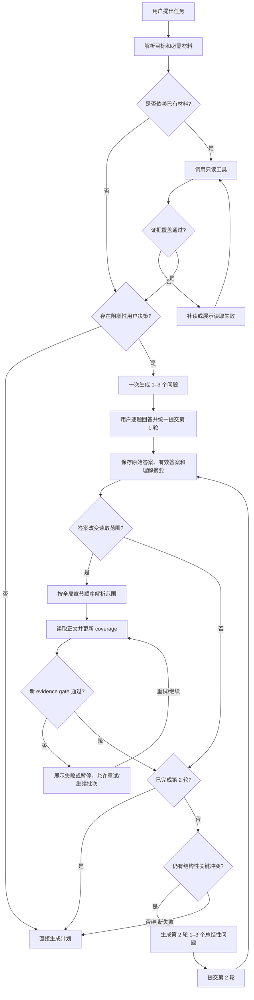
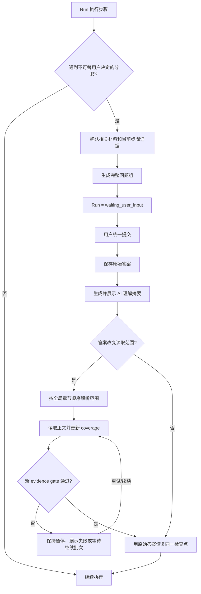

# Agent 结构化问答与用户决策需求

版本：v0.2

日期：2026-07-27

状态：主体已实现；章节读取委托与可执行范围选项待实现

适用范围：计划生成前的需求澄清、Run 执行中的创作决策、正文与附件读取、Agent Workspace 问答卡、Python Runtime 状态机、IPC/SSE 协议、会话恢复和上下文压缩。

## 1. 背景

当前 Agent 有两套互不统一的用户输入流程：

- 计划生成前，模型通过 `needsClarification=true` 返回一段普通 assistant 文本，用户再用聊天输入框回答。
- Run 执行中，Runtime 通过单题 `approval_required` 暂停任务，前端展示一张单选卡。

现状存在以下问题：

1. 模型可以在没有调用 `chapter.get`、`attachment.read`、`rag.ask` 等读取工具的情况下，仅根据用户问题猜测创作方向并提问。
2. 计划前澄清没有结构化问题、推荐项、选项倾向、自定义答案和分步提交体验。
3. 执行中断点一次只能表达一个问题，不能先整体设计一组有关联的问题。
4. 普通 assistant 文本无法可靠区分“模型回复”和“等待用户决策”，不利于恢复、压缩和后续计划引用。
5. 当前自由输入和默认选项可能同时存在，用户实际选择不明确。

本需求将两条链路统一为 Codex App 风格的结构化问答：Agent 先读取完成任务所需的已有材料，再一次生成一组最关键的问题；界面逐题展示，用户最后统一提交；系统根据问答发生阶段生成计划或恢复执行。

## 2. 已确认决策

1. **同时覆盖计划前与执行中。** 两个阶段共用一套问题、答案、持久化和渲染协议。
2. **先读取，后提问。** 只要问题依赖已有正文、附件或设定，Runtime 必须先取得可验证的读取证据，不能只靠 Prompt 约束模型。
3. **按轮整组生成。** 模型在一轮结构化输出中生成完整问题组，并负责问题顺序和措辞；计划前最多两轮，执行中固定一轮。
4. **Codex-like 限制。** 每组包含 1–3 个短问题；每题包含 2–3 个互斥方向；推荐项排在第一位；每个方向用一句话说明结果、倾向或代价。
5. **Codex 式直接操作。** 不默认选择；点击预设项立即保存并自动翻页，最后一题直接提交；可以返回上一题修改。
6. **固定提供自定义答案。** “都不是，告诉我如何做”由客户端统一添加，不占模型的 2–3 个建议名额。选择它后必须输入内容，并取消该题的预设选项。
7. **计划前提交后生成计划。** 原始答案和 AI 理解结果进入计划上下文，不再要求用户把答案重新发送到聊天框。
8. **执行中提交后自动恢复。** 时间线展示“用户答案 + AI 理解摘要”，随后恢复 Run，不额外增加一次确认；用户原始答案是执行事实源，AI 摘要不能覆盖原始答案。
9. **不处理旧会话迁移。** 已存在会话中的普通澄清消息、旧 `approval_required` 和旧运行快照可保持原状；新请求只写入新协议。
10. **跳过有确定性语义。** 原始答案保存为 `skipped`，有效答案固定采用该题第一项推荐方案。
11. **关闭整组。** 计划前关闭返回普通聊天；执行中关闭取消当前 Run。
12. **用户最新原始答案优先。** 同一请求或 Run 中，用户后提交的明确意见覆盖 AI 选项、旧答案和默认值；AI 理解摘要不能缩小、替换或重新授权。
13. **范围答案必须可执行。** 范围选项绑定结构化读取指令；自定义范围先解析并真实读取正文，再生成计划或恢复 Run。
14. **读取委托不授予写入。** “可以选择附近章节”允许自适应读取上下文，但不会把这些章节自动加入草稿或写回目标。

## 3. 目标与非目标

### 3.1 目标

- 让用户在不写长段自然语言的情况下明确关键创作取舍。
- 确保推荐方向来源于真实正文、附件或项目设定，而不是只根据用户提问猜测。
- 让有关联的问题在同一批次内有清晰顺序，又不形成无限追问。
- 让问答在刷新、重启、上下文压缩后仍可恢复。
- 让计划和执行严格消费相同的结构化答案。
- 保留用户自由表达的入口，并明确它与预设选项互斥。

### 3.2 非目标

- 不把所有普通聊天问题都转成问答卡。
- 不实现题内条件分支或每答一题重新调用模型；仅在第一轮整组提交后允许一次结构化追问判断。
- 不让模型通过问答获得新增写入权限；现有计划审核、草稿审核和写回权限不变。
- 不允许一个问题多选；需要组合方向时必须将组合方案写成一个独立选项。
- 不迁移或批量清洗旧会话数据。
- 不用 AI 理解摘要替代或改写用户原始答案。

## 4. 何时触发结构化问答

### 4.1 应触发

只有同时满足以下条件时才触发：

1. 当前选择会实质改变计划、草稿或后续工具参数。
2. 该选择属于用户偏好、创作意图、风险取舍或业务授权，无法从正文和项目数据中唯一推导。
3. 不得到答案就无法安全形成计划，或继续执行会产生明显不同的结果。
4. 相关材料已经成功读取；或者问题本身与任何已有材料无关。

典型场景：

- 主角应主动背叛、被迫背叛，还是暂时保持双解。
- 多章改写应优先强化悬念、人物关系还是信息密度。
- 证据不足时，是谨慎生成带标记草稿，还是只保留分析报告。
- 两条设定互相冲突时，本次草稿采用哪一个版本。

### 4.2 不应触发

- 能通过只读工具获得的事实，例如“第二章叫什么”“当前选中了哪两章”。
- 已在用户消息中明确表达的选择。
- 不影响结果的语气、格式或微小实现细节。
- 仅为了让用户确认模型已经知道的事实。
- 读取失败时用猜测选项代替读取。
- 普通知识问答或用户明确要求“直接分析，不要生成计划”的聊天。

### 4.3 触发优先级

```text
用户请求
  -> 解析目标范围和任务类型
  -> 先用范围元数据判断是否依赖已有材料，不预读正文
  -> 仅当问题和推荐确实依赖项目证据时，完成必须的只读工具调用和覆盖校验
  -> 判断是否存在阻塞性用户决策
       -> 否：正常回复或生成计划
       -> 是：生成完整结构化问题组
```

## 5. 强制读取与证据门槛

### 5.1 原则

“先读取”只适用于依赖项目材料的问题，必须是 Runtime 可验证的状态，不依赖模型自报“我已经阅读”。与项目材料无关的用户偏好问题允许零证据展示；依赖材料的问题组只有在 `evidenceGate=passed` 时才能展示。

读取来源包括：

- `chapter.get`：指定章节正文。
- `chapter.list`：章节范围和顺序发现，不单独视为已读取正文。
- `attachment.outline` / `attachment.read`：附件结构与正文。
- `rag.ask` / `search.query`：跨章证据检索。
- `plotline.list`、`character.list`、`worldsetting.list` 等：结构化设定。
- 当前编辑器正文快照：仅能覆盖与快照 `chapterId` 完全一致的单章；多章任务仍需读取其余章节。

### 5.2 覆盖规则

| 用户范围 | 展示问题前的最低证据 |
| --- | --- |
| 单个当前章 | 同一 `chapterId` 的编辑器正文快照，或成功的 `chapter.get` |
| 明确选中多个章节 | 一次成功的权威 `chapter.scope_context.build` 覆盖全部选中 `chapterId`，或每章均有成功的 `chapter.get`；不能只读取锚点章 |
| 当前卷/全卷 | `chapter.list` 确认范围，并读取与决策直接相关的章节；推荐必须标明实际覆盖范围 |
| 全书或跨卷 | `rag.ask`/`search.query` 获取候选证据，再对关键命中调用 `chapter.get`；不得声称通读未覆盖章节 |
| 附件 | `attachment.outline` 后按相关范围调用 `attachment.read`；短附件可直接完整读取 |
| 设定冲突 | 对应的 list/get 工具成功返回冲突双方 |

### 5.3 Runtime 校验

Exploration Graph 的审计观察记录必须保留 `toolName`、规范化参数、成功状态、目标 ID、内容版本或 Hash、覆盖范围和可展示的来源标题。模型返回 `inputRequest` 时，Runtime 执行以下检查：

1. 根据意图操作和选择范围计算 `requiredEvidence`。
2. 使用 `audit_observations`，而不是可能被压缩的 Prompt 观察，计算实际覆盖。
3. 若覆盖不足且仍有读取预算，强制继续探索并补齐准确的工具调用。
4. 若读取失败、超时或目标不存在，返回明确的读取失败卡，并提供“重试读取”；不得展示推测的问题和推荐项。
5. 若仅完成部分大范围读取，可以提问，但问题卡必须显示“基于已读取的 X/Y 章”，且选项不能声称代表未读范围。

### 5.4 来源展示

问题卡顶部显示紧凑的读取状态，例如：

```text
已读取：第 12 章《失约》、第 13 章《雨夜》 · 2/2
```

推荐原因可以引用来源标签，但不在卡片中大段复制正文。点击来源可打开现有章节或附件只读查看入口。

### 5.5 章节范围答案

章节范围问题遵循 [Agent 章节读取范围与委托需求](./chapter-read-scope-delegation-requirements.md)：

- “当前章 + 上一章”等明确范围按整本小说顺序确定性解析，允许跨卷。
- “可以选择附近章节”等表达建立一次任务内的只读委托，由 AI 根据证据缺口自适应选择；不得固定为同卷或前后 N 章。
- 自定义答案与预设选项冲突时只采用用户自定义原文；解析失败时继续询问，不得回退到推荐项或 `current_chapter`。
- 范围变化会使旧 evidence gate 失效。Runtime 必须先完成新的范围解析和正文读取，再生成内容选项、计划或恢复执行。
- 工程预算只决定分批、摘要、暂停与继续方式，不构成用户读取授权的章节数量上限。

## 6. 问题生成规则

### 6.1 数量与结构

- 每组 1–3 题，只询问最高影响且当前必须决定的问题。
- 每题 2–3 个互斥选项。
- 每题恰好一个推荐项，推荐项必须排在第一位。
- 每个选项包含短标签和一句结果/倾向/代价说明。
- 问题标题应简短，问题正文应能独立理解。
- 选项不能是同义改写，也不能把推荐倾向隐藏在夸张措辞中。

### 6.2 关联问题

模型一次看到整组问题，并按以下方式处理关联：

1. 先问决定总体方向的问题，再问同一方向下仍然成立的执行偏好。
2. 后续问题不得依赖用户尚未作出的某个特定答案，否则应把组合结果合并为前一题选项。
3. 每题必须可在同一批次独立作答；不支持 `showWhen` 或题内动态跳题。
4. 如果不确定项超过 3 个，只问对当前阶段影响最大的 3 个；其余可以写入计划假设，或留到真正执行到该步骤时再触发新的执行中问答。
5. 计划前第一轮提交后，仅当仍有会改变步骤、范围、产物或核心创作方向的冲突时生成第二轮；第二轮默认一个综合取舍问题，且不得重复第一轮。
6. 改变读取范围的授权问题不得与依赖该新范围正文的内容判断问题放在同一问题组，除非所有范围选项所需 evidence 已经覆盖。否则先提交范围问题，进入 `scope_reading`，再基于新证据创建后续问题或恢复执行；不得先展示基于旧范围的内容选项。

### 6.3 推荐项

推荐项必须同时满足：

- 与已读取内容和用户目标一致。
- 说明为什么更适合当前材料，而不是只说“推荐”。
- 不冒充用户偏好；证据只能支持推荐，不能代替用户决定。
- 在证据不足时采用可逆、保守或只生成审核草稿的方向。

模型输出的推荐项即第一项。Renderer 不默认选中，界面使用独立“推荐”徽标；用户点击“跳过”时才确定性采用第一项。

### 6.4 自定义答案

Renderer 在每题选项末尾固定追加：

```text
都不是，告诉我如何做
[输入具体要求……]
```

行为规则：

- 点击自定义项时清除预设 `selectedOptionId` 并聚焦输入框。
- 点击任一预设项时立即保存该答案并前进；未提交的自定义草稿不作为正式答案。
- 自定义项激活但内容为空时，“下一步/提交”禁用。
- 自定义文本按普通用户输入进行长度、控制字符和 IPC 校验。

## 7. 用户界面

### 7.1 问答卡

```text
需要你决定                         1 / 3
已读取：第 12 章《失约》、第 13 章《雨夜》

背叛方式
这两章里，主角的“背叛”采用哪一种定性？

① 主动背叛                         [推荐]
  强化他的主动选择和代价，让冲突更有张力。

② 被迫背叛
  保留人物同情度，但冲突更偏向外部压迫。

③ 暂时保持双解
  强化悬念，后续章节再揭示真实动机。

○ 都不是，告诉我如何做

                          [下一个问题]
```

### 7.2 翻页与提交

- 打开卡片时不默认选中，第一页获得焦点。
- 顶部显示上一题、题号、下一题和关闭；下一题仅在当前题已有答案或已跳过时可用。
- 点击预设项自动前进；最后一题点击预设项会直接提交整组。
- 自定义行在非末题显示“下一步”，末题显示“提交”。
- 顶部显示 `当前题号 / 总题数`，已答题状态必须保留。
- 用户可在提交前任意返回修改；提交后卡片变为只读答案记录。
- “跳过”保存原始 `skipped`，并以推荐项作为有效答案继续。
- 计划前可以关闭卡片并回到编辑输入，关闭不会生成计划。
- 执行中关闭会取消当前 Run；若只想按默认方案继续，应点击“跳过”。

### 7.3 提交后的时间线

提交后原卡片替换为可折叠的只读记录：

```text
已提交 3 个决定
1. 背叛方式：主动背叛
2. 信息揭示：延迟揭示
3. 情绪基调：压抑克制

AI 理解：本次改写会把背叛写成主角的主动选择，延后暴露真实目的，
并保持克制的情绪表达；不会替主角增加被迫行动的免责设定。
```

自定义答案必须原文显示。来源、答案和 AI 理解摘要可以折叠，但提交状态和阶段不可隐藏。

## 8. 两阶段流程

### 8.1 计划生成前



提交后由 Runtime 在完成必要的范围解析、正文读取和 evidence gate 后自动进入计划生成，不要求用户再发送一条消息。读取失败或达到当前任务 deadline 时停在可恢复状态，不得带着旧范围直接生成计划。计划目标包含单独的“用户已确认决策”结构，不把问答 UI 文案拼接成普通会话背景。

计划卡至少展示与本计划有关的决策摘要；Planner 必须同时收到原始答案 ID、选项语义和自定义原文。

### 8.2 Run 执行中



AI 理解摘要不增加新的决策，不要求二次确认。若摘要模型调用失败，系统用选项标签、说明和自定义原文生成确定性摘要，然后继续；不得因为摘要失败丢失已提交答案。

## 9. 数据协议

### 9.1 问题请求

```ts
type AgentUserInputPhase = 'pre_plan' | 'execution';

type AgentUserInputEvidence = {
  evidenceId: string;
  sourceKind: 'editor_snapshot' | 'chapter' | 'attachment' | 'rag' | 'search' | 'creative_setting';
  sourceId: string;
  title: string;
  version?: string;
  contentHash?: string;
  coverage?: string;
};

type AgentUserInputOption = {
  optionId: string;
  label: string;              // 建议 1–5 个词或短语
  description: string;        // 一句话说明倾向、结果或代价
  evidenceIds?: string[];
  scopeDirective?: AgentReadScopeDirective;
};

type AgentUserInputQuestion = {
  questionId: string;
  header: string;             // 不超过 12 个汉字
  prompt: string;
  options: AgentUserInputOption[]; // 2–3 个，第一项为推荐项
  recommendedOptionId: string;
  recommendationReason: string;
  evidenceIds?: string[];
  allowCustom: true;
};

type AgentUserInputRequest = {
  schemaVersion: 'agent-user-input-v1';
  requestId: string;
  inputSessionId: string;
  conversationId: string;
  phase: AgentUserInputPhase;
  round: 1 | 2;
  maxRounds: 1 | 2;
  previousRequestId?: string;
  title: string;
  reason: string;
  questions: AgentUserInputQuestion[]; // 1–3 个
  evidence: AgentUserInputEvidence[];
  planDraftContextId?: string;
  runId?: string;
  stepId?: string;
  createdAt: string;
};
```

约束必须由 Runtime 校验，不能只依赖 TypeScript 类型：

- `questions.length` 为 1–3。
- ID 在请求内唯一且仅允许稳定安全字符。
- 每题选项为 2–3，`recommendedOptionId === options[0].optionId`。
- 标签、问题、说明和推荐原因有服务端长度上限。
- 所有 `evidenceIds` 必须存在于同一请求，且来自本轮已成功读取的审计观察。
- `execution` 必须包含有效的 `runId`、`stepId`，并与当前 pending request 匹配。
- 范围选项的 `scopeDirective` 必须能解析为当前小说的真实章节或受约束的自适应读取策略；模型不得填写授权来源。
- 内容判断选项必须通过 evidence gate；尚未读取正文的范围选项只能说明授权、成本和覆盖差异，不能使用内容型推荐理由。

### 9.2 提交答案

```ts
type AgentUserInputAnswer =
  | {
      questionId: string;
      answerKind: 'option';
      selectedOptionId: string;
    }
  | {
      questionId: string;
      answerKind: 'custom';
      customText: string;
    }
  | {
      questionId: string;
      answerKind: 'skipped';
    };

type AgentUserInputEffectiveAnswer = {
  questionId: string;
  answerKind: 'option' | 'custom';
  selectedOptionId?: string;
  customText?: string;
  source: 'user' | 'recommended_fallback';
};

type SubmitAgentUserInputParams = {
  requestId: string;
  conversationId: string;
  runId?: string;
  answers: AgentUserInputAnswer[];
  context: AgentContextPayload;
};

type AgentUserInputResolution = {
  requestId: string;
  inputSessionId: string;
  round: 1 | 2;
  phase: AgentUserInputPhase;
  status: 'resolved' | 'dismissed';
  answers: AgentUserInputAnswer[];
  effectiveAnswers: AgentUserInputEffectiveAnswer[];
  understandingSummary: string;
  resolvedReadScope?: AgentResolvedReadScope;
  resolvedAt: string;
  nextAction: 'follow_up_required' | 'scope_reading' | 'plan_created' | 'run_resumed' | 'returned_to_chat' | 'run_cancelled';
  pendingUserInput?: AgentUserInputRequest;
  plan?: AgentPlan;
  run?: AgentRun;
};
```

提交必须是整组原子操作：少题、重复题、未知选项、空自定义内容、过期 request 或 run/checkpoint 不一致时整体拒绝，不保存部分答案。

### 9.3 Chat、IPC 与 SSE

- `AgentChatResponse` 新增 `pendingUserInput?: AgentUserInputRequest | null`。
- `window.agent.submitUserInput(params)` 是计划前和执行中的统一提交入口。
- `window.agent.dismissUserInput(params)` 负责关闭整组，并按阶段返回聊天或取消 Run。
- `AgentRun.pendingApproval` 改为 `pendingUserInput`。
- Run 状态 `waiting_approval` 改为 `waiting_user_input`。
- SSE 使用 `user_input_required` 事件，payload 为完整 `AgentUserInputRequest`。
- 提交后发出 `user_input_resolved`，payload 只包含答案标签、自定义原文、理解摘要和请求 ID，不复制读取到的大段正文。
- 新流程只写 `user_input_required`；旧 `approval_required` 历史只读兼容，不迁移也不回填。

## 10. Runtime 与模型职责

### 10.1 Runtime 负责

- 判断并验证读取覆盖。
- 解析用户原始范围意见，维护全局跨卷章节顺序、读取授权和实际 resolved scope。
- 在 request 创建或答案提交时冻结具体 `anchorChapterId`，不受后续编辑器导航影响。
- 用户答案改变范围时，使旧 evidence gate 失效，并在计划或恢复 Run 前完成补读。
- 拒绝把范围授权题和依赖该范围未读正文的内容题放入同一问题组，除非候选 evidence 已全部覆盖。
- 执行只读工具、保留审计观察和生成证据引用。
- 校验模型产生的问题组结构和长度。
- 创建唯一 request，暂停/恢复状态机并持久化。
- 原子校验和保存用户答案。
- 将原始答案注入 Planner 或 Run checkpoint。
- 在崩溃、刷新和重启后恢复 pending request。
- 保证重复提交幂等；同一 request 返回首次成功结果。
- 第一轮提交后调用一次结构化追问判断；第二轮结束后拒绝继续追问并强制生成计划。

### 10.2 模型负责

- 根据工具观察识别真正需要用户决定的事项。
- 每轮一次设计完整问题组、问题顺序、互斥选项和推荐原因。
- 第二轮仅总结第一轮仍未解决的结构性冲突，不得由模型任意发起与答案无关的新读取或重复问题；但用户答案改变读取范围时，Runtime 必须进入 `scope_reading` 并在继续前完成必要补读。
- 让每个选项体现不同倾向和可理解的后果。
- 范围选项只输出可执行 `scopeDirective`；内容选项只引用实际读取且可查看的 evidence。
- 提交后生成忠实、简短的理解摘要。
- 不把可以通过工具查询的事实包装成用户问题。
- 不在理解摘要中增加用户未选择的设定。

### 10.3 Renderer 负责

- 逐题展示、直接操作、自动翻页、返回改选、校验和统一提交。
- 客户端固定添加自定义项，不允许模型伪造或删除。
- 自定义和预设选项保持互斥。
- 展示读取来源、推荐标记和提交后的只读记录。
- 范围答案额外展示用户原文、解析后的真实章节和实际 coverage；跨卷只影响标题展示，不阻断邻接。
- 仅发送结构化答案，不自行拼接“用户选择了……”的聊天文本。

## 11. 上下文、压缩与持久化

- Pending request 和已提交 resolution 是结构化 Runtime 状态，不以普通 assistant/user 消息作为事实源。
- 问题卡、进度和状态回执属于 `workflow_notice`，不进入普通聊天历史选择函数。
- Planner 和 Run Context Assembler 单独注入 `UserDecisions`，内容包含 request、原始答案、选项说明、自定义原文和理解摘要。
- 未解决请求不得被上下文压缩删除；压缩只可以缩短证据摘要，不能删除证据 ID、目标 ID、原始答案或 pending 状态。
- 已解决的执行决策至少保留到 Run 终止；计划前决策至少保留到计划被替换、忽略或执行结束。
- 时间线渲染从结构化记录恢复。刷新后应回到离开前题号；未提交的本地草稿答案可存 Renderer 会话状态，但不能被视为正式答案。
- 用户原始答案优先级高于 AI 理解摘要；发现冲突时使用原始答案并记录诊断。

## 12. 错误、取消与并发

| 场景 | 行为 |
| --- | --- |
| 读取工具失败 | 不生成问题；展示失败来源、诊断引用和“重试读取” |
| 范围答案触发的补读失败 | 保持 `scope_reading` / `waiting_user_input`，展示失败章节和重试入口；不得生成计划或恢复 Run |
| 只读覆盖不足 | 继续探索或明确显示部分覆盖，不得伪装完整阅读 |
| 问题 schema 无效 | 最多让模型修复一次；仍失败则返回可重试错误 |
| 理解摘要生成失败 | 使用确定性答案摘要，计划/Run 仍可继续 |
| 用户重复点击提交 | 以 `requestId` 幂等，返回第一次成功结果 |
| 两个窗口同时提交 | 仅第一个提交成功，另一个收到“该问题已处理”并刷新状态 |
| Run 已取消或步骤变化 | 拒绝过期答案，不把它应用到其他步骤 |
| 应用重启 | 从 Runtime state/SQLite 恢复同一 pending request |
| 用户停止执行中任务 | 取消 Run，同时将 pending request 标记为 cancelled |
| 用户关闭计划前问答 | 清除 pending request，不生成计划；已输入但未提交内容不进入模型上下文 |

## 13. Prompt 与结构化输出要求

`agent.generate_chat` 不再用 `content + needsClarification` 表达问题。建议改为互斥输出：

```json
{
  "content": "",
  "shouldPlan": false,
  "inputRequest": {
    "title": "先确认关键创作方向",
    "reason": "这些选择会改变两章的改写方案。",
    "questions": []
  },
  "toolCalls": []
}
```

规则：

- 存在未完成的必需读取时，只能返回 `toolCalls`，不能同时返回可展示的 `inputRequest`。
- `inputRequest` 存在时 `shouldPlan=false`，普通 `content` 只允许短前言，不能再包含另一套文本问题。
- Runtime 在证据门槛通过后才把 `inputRequest` 规范化为 `AgentUserInputRequest`。
- 提交答案后的 Planner Prompt 将原始选择作为独立 JSON 区块，禁止仅依赖自然语言会话回放。
- 执行中 checkpoint detector 使用相同 question schema，不再分别维护分析范围、证据质量、创作方向三种 UI 协议；`checkpointType` 可作为内部分类保留。

## 14. 验收场景

### 14.1 两章改写、计划前提问

前置：用户选中两个章节，输入：

> 把这两章改得更有张力，但我还没决定主角是主动背叛还是被迫背叛。不要替我决定，生成计划前先问我。

验收：

1. 事件/工具记录中两个选中章节都出现成功的 `chapter.get`。
2. 在第二章读取完成前不显示问题卡。
3. 问题卡包含 1–3 题，第一题围绕背叛定性，推荐项基于两章实际内容给出原因。
4. 三个选项倾向明显不同，例如主动、被迫、保持双解。
5. 初始无选中项；点击预设项立即保存并行动，点击跳过才采用第一项推荐兜底。
6. 最后一题提交后，系统完成答案要求的范围解析和正文补读，再自动生成计划；补读失败时保持可重试，不得基于旧范围继续。
7. 计划目标包含用户原始答案，不包含“请选择 A/B/C”一类 UI 文案。

### 14.2 执行中创作方向分歧

1. Run 在具体步骤暂停为 `waiting_user_input`。
2. 重启软件后仍显示同一问题组和 Run。
3. 提交后时间线显示每题答案和 AI 理解摘要。
4. Run 从同一 checkpoint 恢复，不重复已经完成的写入或工具副作用。
5. 实际执行参数来自原始答案；故意让摘要与答案冲突时，测试应证明原始答案胜出。

### 14.3 无需提问

用户已明确“写成主动背叛，延后两章揭示动机”。读取后应直接生成计划，不得为了形式再次询问背叛类型。

### 14.4 读取失败

模拟第二个 `chapter.get` 失败。系统必须显示读取失败和重试入口，不能根据第一章生成“推荐方向”。

### 14.5 问题组关联

模型输出的问题必须可同时回答；测试拒绝“只有第一题选择 A 时才有意义”的无条件第二题。超出三项的非阻塞选择应进入计划假设或后续执行 checkpoint。

### 14.6 自定义答案

每题选择“都不是”，输入具体要求，来回切换页面再提交。答案原文应完整进入计划/Run，未选中的默认项不得同时提交。

## 15. 测试计划

- Python 单元测试：证据门槛、范围覆盖、schema 校验、问题顺序、原子提交、幂等和过期 request。
- Exploration Graph 测试：有目标正文时先工具调用再 `inputRequest`；读取失败时不能进入提问路由。
- IntentService 测试：`inputRequest`、直接计划、普通聊天、失败重试的路由互斥。
- Runtime 测试：计划前提交后先完成必要 `scope_reading` 再创建计划；执行中提交后先完成必要补读再恢复相同 checkpoint。
- Context 测试：UI 通知不进入聊天历史，结构化原始答案始终进入 Planner/Run，上下文压缩不丢 pending request。
- TypeScript 合约测试：IPC、preload、SSE、Run projection 和 SQLite JSON 往返。
- Renderer 单元测试：初始无选中、跳过时采用第一项推荐兜底、翻页、返回、自定义互斥、末页提交、重复提交禁用和恢复。
- 端到端回归：选择两章 → 读取两章 → 问答 → 生成计划 → 实施 → 执行中再次问答 → 重启 → 恢复 → 完成草稿。
- Intent 优先回归：无需正文即可形成计划的请求在问题判断前零次读取；只有证据型问题进入范围装配。
- 构建验证：Python tests、Agent 脚本测试、TypeScript 检查和桌面端构建。

## 16. 实施拆分

### P0：协议与计划前闭环

1. 新增共享 `AgentUserInput*` 类型和 Runtime schema。
2. 扩展 `agent.generate_chat` 结构化输出并加入证据门槛。
3. 用 `pendingUserInput` 替换新流程的 singular clarification。
4. 实现问答卡、翻页、自定义答案和统一提交。
5. 提交后完成必要的范围解析和正文补读，再自动生成计划，并保证原始答案进入计划上下文。

### P1：执行中统一

1. 将 `approval_required` 检查点迁移到 `user_input_required`。
2. 实现 `waiting_user_input`、统一 submit、AI 理解摘要和恢复执行。
3. 增加 SSE 重连、重启恢复、幂等提交和过期校验。

### P2：体验与可观测性

1. 来源点击、覆盖进度和读取失败重试。
2. 问答答案时间线折叠卡。
3. 指标与诊断：问题触发率、读取覆盖率、自定义答案率、推荐项采用率、提交耗时、读取失败率、恢复成功率。

## 17. 完成定义

本需求完成必须同时满足：

- 用户示例中的两章在问题展示前均有真实读取记录。
- 计划前和执行中使用同一套 1–3 题结构化问答 UI。
- 默认推荐项、自定义答案、逐题翻页和末页提交行为无歧义。
- 计划前问答提交后完成必要补读再生成计划；执行中提交后展示答案与 AI 理解摘要，完成必要补读后再恢复 Run。
- 原始答案是唯一执行事实源，刷新、重启和上下文压缩后不丢失。
- 读取失败时不再出现脱离文章内容的猜测式选项。
